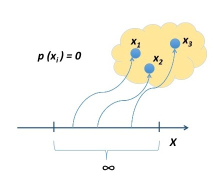
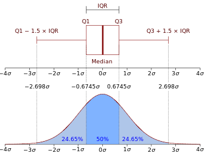
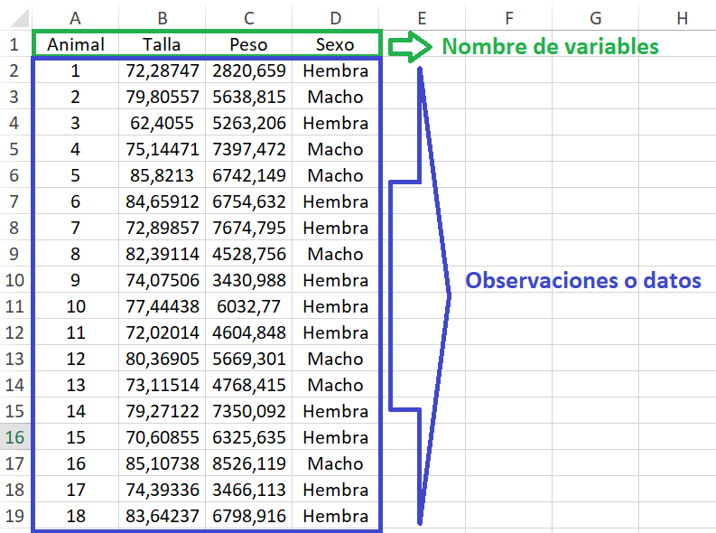
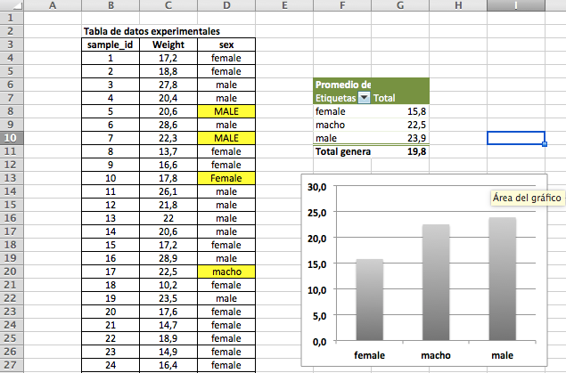
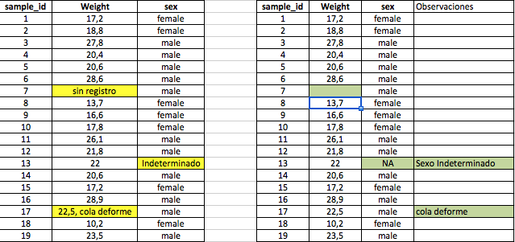

```{r setup, include=FALSE}
knitr::opts_chunk$set(echo = FALSE)
library(MASS)
library(psych)
library(knitr)
library(Rlab)
library(ggplot2)
library(readxl)
```


## **PLAN DE LA CLASE**

1. **Introducción**

- Diferencia entre variable, variable aleatoria, datos y factores.

- Clasificación de variables aleatorias.

- Observar y predecir variables cuantitativas continuas.

- Formato correcto para importar datos a R.

2. **Práctica con R y Rstudio cloud**

- Elaborar un script de R e importar datos desde excel.

- Observar y predecir variable aleatoria con **distribución normal**.

## **CONCEPTOS Y DEFINICIONES**

1. **Variable**  
Características que se pueden medir u observar en un individuo o en un ambiente: peso, temperatura, sexo, crecimiento, madurez, flotabilidad, rendimiento, sobrevivencia, biomasa cosechada.

2. **Variable aleatoria**  
Una variable aleatoria es una función que asigna un valor numérico a cada posible resultado de un experimento aleatorio. Según el tipo de variable aleatoria que se este analizando, tendrá una función de probabilidad o función de densidad asociada.

## **CONCEPTOS Y DEFINICIONES**

3. **Datos u observaciones**  
Son los valores que puede tomar una variable aleatoria. 6,5 Kg, 55 cm, 25 células por mililitro, Sexo= macho o hembra, 13ºC, Lesiones Bacterianas = ausente, leve, mediano, severo; resistencia: Si (vivo) o NO (muerto).

4. **Factor**  
Usado para identificar tratamientos de un experimento o variables de clasificación. Se podrían usar como **_variables independientes o predictoras_**; es decir, tienen un efecto sobre una *variable dependiente o respuesta*. Ej. **Sexo** (niveles: **_macho_** o **_hembra_**) tiene un efecto sobre nivel de hormonas.

## **CLASIFICACIÓN DE VARIABLES**

```{r, echo=FALSE, out.width = '100%', fig.align='center'}
knitr::include_graphics("TiposVariables.png")
```

## **VARIABLE ALEATORIA CUANTITATIVA CONTINUA**

**Definición:** Puede tomar cualquier valor dentro de un intervalo (a,b), (a,Inf), (-Inf,b),(-Inf,Inf) y la probabilidad que toma cualquier punto es 0, debido a que existe un número infinito de posibilidades.


```{r, echo=FALSE, out.width = '50%', fig.align='center'}

```

## **OBSERVAR VARIABLE CONTINUA CON HISTROGRAMA**

- **hist()** permite hacer un histograma. Cuando aumenta el **n** muestral se perfila una distribución llamada **normal**.    

```{r, echo=FALSE, out.width = '70%', fig.align='center'}
par(mfrow=c(1,2))
set.seed(123)
q<-rnorm(50, 0, 1)
hist(q, col="red", main = "n= 50", xlab = "Variable estandarizada", cex.lab=1.5, cex.axis=1.5, cex.main=1.5, cex.sub=1.5, )
q1<-rnorm(10000, 0, 1)
hist(q1, col="red", main = "n= 10000", xlab = "Variable estandarizada", cex.lab=1.5, cex.axis=1.5, cex.main=1.5, cex.sub=1.5, )
```

## **OBSERVAR CON BOXPLOT**

Las gráficas de cajas y bigotes son muy adecuadas para observar la distribución de las variables aleatorias continuas **boxplot()**.

[^1]: **IQR =** **_Rango intercuantílico_** es la diferencia entre el tercer cuartil (75%) y el primer cuartil (25%) de una distribución.

```{r, echo=FALSE, out.width = '80%', fig.align='center'}


```


## **PREDICCIÓN CON DISTRIBUCIÓN NORMAL**

- Si la variable aleatoria tiene una distribución normal, podemos predecir la probabilidad de que la variable tome un determinado valor dentro de un intervalo (ej. 13,59%).

```{r, echo=FALSE, out.width = '100%' }
knitr::include_graphics("Normal.png")
```

## **PREDECIR CON DISTRIBUCIÓN ACUMULADA**

- La función de distribución empírica acumulada **ecdf()** permite predecir la probabilidad de que la variable aleatoria tome un valor determinado.

```{r, echo=FALSE, out.width = '80%', fig.align='center'}
q2<-rnorm(100000, 0, 1)
plot(ecdf(q2),main= "Distribución empírica acumulada.", col="red", cex.lab=1.5, cex.axis=1.5, cex.main=1.5, cex.sub=1.5, ylab="Probabilidad", xlab = "Variable estandarizada (media=0, sd=1)")
```

## **FORMATO CORRECTO PARA IMPORTAR A R**

```{r, echo=FALSE, out.width = '75%', fig.align='center', fig.cap="Formato correcto de archivo excel para que sea importado a R."}

```

## **ERRORES EN FORMATO EXCEL**
```{r, echo=FALSE, out.width = '75%', fig.align='center', fig.cap="Errores comunes antes de importar a excel."}

```

**Importante:** No colocar símbolos matemáticos por ejemplo (%,$,+) como nombres de las **(variables)**.

## **ERRORES EN FORMATO EXCEL 2**
```{r, echo=FALSE, out.width = '80%', fig.align='center', fig.cap="Errores comunes antes de importar a excel."}

```

**Importante:** No colocar comentarios en las celdas de datos. Dejar celdas vacías o usar el símbolo *NA* es preferido cuando hay datos faltantes.

## **COMO IMPORTAR DATOS A R**

El paquete **readxl** es muy útil para importar datos a R. Pero debe tener cuidado con: separador de columnas, decimales y valores faltantes.

```{r, echo=TRUE, out.width = '100%', fig.align='center'}
library(readxl)
salmon<-read_excel("datos.xlsx",
                   sheet = 1, na = "NA")
```

## **PRÁCTICA VARIABLES ALETORIAS**

**Guía de trabajo programación con R en Rstudio.cloud**.

```{r, echo=FALSE, out.width = '80%',fig.align='center'}
knitr::include_graphics("Run.png")
```

## **RESUMEN DE LA CLASE**

- Identificamos y clasificamos variables.

- Observamos la distribución de una variable cuantitativa continua usando histograma y boxplot.

- Predecimos el comportamiento de una variable cuantitativa continua con distribución normal usando funciones de densidad y de distribución enpírica acumulada.

- Es importante identificar la naturaleza que tiene nuestra variable en estudio, y así evitar errores en los análisis estadísticos que llevemos a cabo. No siempre tendrá distribución normal.
