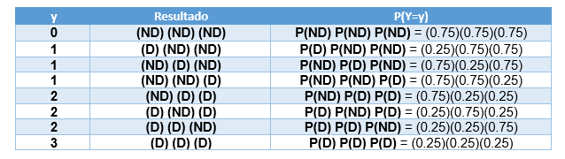

```{=html}
<style>
#TOC {
  color: black;
  font-familiy: Calibri;
  font-size: 14px;
  border-color: #708090; 
}
body {
   color: black;
   font-familiy: Calibri;
}

pre {
  color: black;
  background-color: #F8F8FF;
}
# header {
  color: #800000;
  font-familiy: Calibri;
  background-color: #F5F5F5;
  opacity: 0.8;
  font-size: 16px;
}
</style>
```

### **Introducción**

**¿Cuál es la diferencia entre variable y dato?**

Las **variables** son las características que se pueden medir en un individuo o en un ambiente y los **datos** son los valores que puede tomar esa variable.

**¿Qué es una variable aleatoria?**

Es una variable cuyo valor se determina por el azar. Las variables aleatorias se representan por letras mayúsculas (**X**) y sus valores numéricos por letras minúsculas ($x_i$).

### **Clasificación de variables cuantitativas**

|   **Tipo de variable**   |  **Descripción** |
|:---:|:-----:|
| **Variables discretas:** | Una variable ***Y*** es **discreta** si puede tomar valores puntales, pueden tener un número finito o infinito de valores. |
| **Variables continuas:** | Una variable ***Y*** es **continua** si puede tomar cualquier valor dentro de un intervalo del conjunto de los números reales. La probabilidad de que tome un valor cualquiera es 0 debido a que existe un número infinito de posibilidades en el intervalo. |

### **Clasificación de variables cualitativas o categóricas**

|   **Tipo de variable**   | **Descripción** |
|:--:|:----:|
| **Variables nominales:** | Sus valores representan categorías que no obedecen a una clasificación intrínseca. |
| **Variables ordinales:** | Sus valores representan categorías con alguna clasificación intrínseca.|

### **Distribuciones posibles para variables aleatorias dicretas**

**Distribución Bernoulli**: la distribución Bernoulli (o distribución dicotómica), nombrada así por el matemático suizo Jacob Bernoulli, es una distribución de probabilidad discreta, donde la variable aleatoria X toma el valor de 1 (**X**=1), cuando ocurre el suceso **éxito** y cuya probabilidad asociada es $p$ y si toma X el valor de cero (**X**=0) ocurre el suceso **fracaso** con probabilidad $q=1-p$. En notación, lo comentado anteriormente sería expresado de la siguiente forma: **P(X=1) =** $p$ (Probabilidad de éxito) y **P(X=0) =** $1-p$ (Probabilidad de fracaso). **_Nota_**: **_La distribución Bernoulli es un caso particular de la distibución binomial cuando_** $n=1$, **_es decir, solo se hace una vez un ensayo_**.

**Distribución Binomial**: la distribución Binomial o distribución binómica es una distribución de probabilidad discreta que cuenta el número de éxitos en una secuencia de $n$ ensayos de Bernoulli independientes entre sí, con una probabilidad fija $p$ de ocurrencia de éxito entre los ensayos y que tiene una probabilidad de fracaso $q=1-p$.

**Distribución binomial negativa**: la distribución Binomial negativa es una distribución de probabilidad discreta que incluye a la distribución de Pascal. Es utilizada en procesos en los cuales se ve necesaria la repetición de ensayos hasta conseguir un número de casos favorables (r-ésimo éxito, es decir, r=2,3,4, etc). 

### **¿Cómo puedo simular números aleatorios con distribución Binomial y Bernoulli?**

| **Librería** | **Función**  |  **Descripción** |
|:----:|:---:|:---:|
| stats | **rbinom(n, size, prob)**  |  Genera (n) números aleatorios para la distribución binomial con parámetros tamaño (size) y probabilidad de éxito de un ensayo (prob) |
| Rlab | **rbern()**| Simular variable aleatoria Bernoulli  |
| MASS | **rnegbin (n, mu, theta)** | Genera (n) números aleatorios para la distribución de binomial negativa con parámetros promedio (mu) y varianza (mu + mu$^{2}$ / theta), donde theta es un número arbitrario para estimar la varianza |

### **¿Cómo puedo observar y predecir el comportamiento de variables con distribución Bernoulli y binomial?**

| **Librería** | **Función**  |                       **Descripción**                       |
|:----------------------:|:----------------------:|:-----------------------:|
|     Rlab     | **dbern()**  |        Función de densidad de probabilidad Bernoulli        |
|     Rlab     | **pbern()**  | Función de distribución de probabilidad acumulada Bernoulli |
|     Rlab     | **qbern()**  |     Función para hallar los cuantiles de una Bernoulli      |
|    stats     | **dbinom()** |        Función de densidad de probabilidad Binomial         |
|    stats     | **pbinom()** | Función de distribución de probabilidad acumulada Binomial  |
|    stats     | **qbinom()** |      Función para hallar los cuantiles de una Binomial      |

### **Objetivos de aprendizaje**

Los objetivos de aprendizaje de esta guía son:

**1**. Observar y predecir el comportamiento de variables aleatorias discretas con distribución Bernoulli, Binomial y binomial negativa.

## **Ejercicios**

### **Ejercicio 1.** **Elaborar un Script de R (Archivo .R)**

Elabore un archivo o file con extensión **.R** usando la barra de herramientas de **Rstudio**. Selecciona **File \> New file \> R script**. Utilice el siguiente ejemplo para completar la información de **metadatos** del script.

    # ----------------------------------------------------------  
    # Clase 03 - Guia Variables Aleatorias discretas y cualitativas.   
    # Su nombre: 
    # 15 abril 2023. 
    # Diplomado en Análisis de Datos y Modelamiento Predictivo con Aprendizaje Automático para la Acuicultura. 
    # ----------------------------------------------------------  

Luego, guarde inmediatamente su script como **script_3_nombre_apellido.R**.

### **Ejercicio 2.** **Configuración de librerías**

Debajo del **metadatos** habilite los paquetes **readxl**, **MASS**, **Rlab** usando la función **library()**. 

```{r setup, include=TRUE, message=FALSE, warning=FALSE}
knitr::opts_chunk$set(echo = FALSE)
library(readxl)
library(Rlab)
library(MASS)
```


### **Ejercicio 3.** **Exportación de salmones del Atlántico.**

Una empresa exportadora de salmones del Atlántico implementa un sistema de inspección visual de los salmones, clasificando a un salmón como defectuoso **(D)** y no defectuoso **(ND)**.

**a).** ¿Qué tipo de variable y distribución mejor representaría a la clasificación de un solo salmón como defectuoso o no defectuoso?

```{r, echo=TRUE}
# Variable aleatoria discreta con distribución Bernoulli
```

**b).** Si en un proceso de inspección visual se detectó un total de 8 productos defectuosos y 24 no defectuosos. ¿Cuál es la probabilidad *p* de que los productos sean defectuosos?. Use la función paste() para redactar su resultado de forma automática. Use la función round() para redondear el resultado a 2 decimales.

```{r, echo=TRUE}
p <- 8 / 32
paste("La proporción de productos defectuosos es = ", round(p,4)*100, "%")
```

**c).** ¿Calcule la probabilidad *q* de que los productos no sean defectuosos?

```{r, echo=TRUE}
q <- 1-p
paste("La proporción de productos no defectuosos es = ", round(q,4)*100, "%")
```

**d).** El comprador en el extranjero desea determinar el número de productos defectuosos recibidos y establece un acuerdo con el vendedor de revisar en cada lote recibido 3 productos. Note que esta nueva variable es una variable aletoria de tipo discreta que tiene distribución binomial con valores de 0, 1, 2 a 3 productos defectuosos por lote. 

Responda las siguientes preguntas usando la información de la siguiente tabla:

```{r, echo=FALSE, out.width = '80%', fig.align='center'}

```

**e).** ¿Cuál es la probabilidad de que el comprador no detecte productos defectuosos (Y = 0)?

```{r, echo=FALSE}
# P(Y=0)  
P_ND <- q*q*q
paste("La probabilidad de que no encuentren productos defectuosos es = ", round(P_ND,4)*100, "%")
```

**f).** ¿Cuál es la probabilidad de que detecte que todos los productos de la muestra sean defectuoso (Y=3)?

```{r, echo=FALSE}
# P(Y=3)  
P_PD <- p*p*p
paste("La probabilidad de que todos los productos de la muestra sean defectuosos es = ", round(P_PD,4)*100, "%")
```

### **Ejercicio 4.** **Veneno paralizante de los mariscos.**

*Alexandrium catenella* es una microalga tóxica que produce el veneno paralizante de los mariscos (VPM). En Chile las intoxicaciones por VPM entre 1972-2002 generaron 456 enfermos y 30 fallecidos (total = 486). A partir de estos antecedentes responda.

**a).** ¿Que tipo de variable y distribución mejor representa a la intoxicación por VPM?

```{r, echo=TRUE}
# "Variable aleatoria discreta con distribución Binomial"
```


**b).** ¿Calcule la letalidad por VPM en Chile?

```{r, echo=TRUE}
LT_VPM <- 30 / 486
LT_VPM
```

**c).** Se ha reportado un intoxicación masiva de veneno paralizante de los mariscos en Calbuco que dio como resultado 80 personas intoxicadas. ¿Cuántas personas se recuperarán (0) y cuantas morirán (1) por esta intoxicación?.

Para responder primero nosotros crearemos para usted un objeto denominado **rvpm** y simularemos el resultado de la intoxicación usando la función **rbinom()**. Usaremos **print()** para observar los datos simulados.

```{r, echo=TRUE}
# set.seed function sets the starting number used to generate a sequence of random numbers
set.seed(123) 

# n representará el número de intoxicados
n <- 80 

# p representará probabilidad de morir con base a datos de letalidad entre 1972 y 2002
p <- 0.0617 

# q representa la probabilidad de sobrevivir. 
q <- 1-p 

# Objeto rvmp contiene la probabilidad de morir = 1 o sobrevivir = 1 para una población simulada de 80 intoxicados.
rvpm <- rbinom(n, size=1, prob=0.0617) 

# Explica datos generados
print(rvpm)
```

**d).** Usando la función **table()** represente la frecuencia esperada de recuperados y fallecidos.

```{r, echo=FALSE}
table(rvpm)
```

**e).** Represente en un histograma la frecuencia de recuperados y fallecidos.

```{r,, echo=FALSE, out.width = '80%'}
hist(rvpm, col="red", main = "Histograma Intoxicación por VPM")
```

**f).** Investigue como se calcula el promedio y la varianza de una variable con distribución binomial. Calcule ambos parámetros para la población de estudio.

Promedio de fallecidos.

```{r, echo=FALSE}
n*p
```

Varianza de fallecidos.

```{r, echo=FALSE}
n*p*q
```

**g).** Cree un objeto llamdo **dvpm** y calcule la función de densidad de los datos simulados rvpm con la función **dbinom()**. Use como argumentos *size=1, prob=0.0617*. Interprete los resultados.

```{r, out.width = '80%', echo=TRUE}
dvpm<-dbinom(rvpm, size=1, prob=0.0617)
dvpm
```

**h).** Gráfique la función de densidad de las intoxicaciones por VPM usando la función plot. En el eje "x" grafique los datos simulados **rvpm** y en el eje "y" la función de densidad **dvpm**.

```{r, echo=TRUE}
plot(x=rvpm, y=dvpm, main="Densidad de rvpm", col="blue4")
```

**i).** Cree un objeto llamdo **pvpm** y calcule la distribución de probabilidad acumulada de los datos simulados rvpm con la función **pbinom()**. Use como argumentos *size=1, prob=0.0617*. Interprete los resultados.

```{r, echo=FALSE}
pvpm<-pbinom(rvpm, size=1, prob=0.0617)
pvpm
```

**j).** Gráfique la distribución de probabilidad acumulada de las intoxicaciones por VPM usando la función plot(). En el eje "x" grafique los datos simulados**rvpm** y en el eje "y" la probabilidad acumulada **pvpm**.

```{r, echo=FALSE}
plot(x=rvpm, y=pvpm, main="Prob. acumul. rvpm", col="red", ylim=c(0,1))
```

### **Ejercicio 4.** **Parásitos en salmones.**

La abundancia de parásitos como el piojo de mar *Caligus rogercresseyi* en los salmones de cultivo puede ser considerada como una variable distreta con distribución binomial negativa. Esto significa que uno suele observar muchos peces con pocos parásitos (ej= 0 o 1) y pocos peces con muchos parásitos. Un estudio demostró que el promedio de la abundancia de parásitos fue de 25 con un rango de 0 a 90. 

**a).** Cree un objeto llamado "caligus" para representar el número de parásitos en los peces. Simule una muestra aleatoria con distribución binomial negativa con la función **rnegbin()**. Considere 500 peces con una media de 25 parásitos. Para simular la varianza debe asignar valores arbitrarios a theta entre 1 y 5 hasta obtener un promedio y rango aproximado al estudio antes descrito (promedio de 25 y rango de 0 a 90).

Generar una muestra desde la población en estudio
```{r, echo=TRUE}
set.seed(123) #es una semilla para obtener los mismos resultados cada vez que se haga la simulación de los datos
# n = 1000 animales
# mu = 25 (parásitos por pez)
# theta = 1 (cambie este valor hasta encontrar uno que se ajuste a los datos observados)
caligus <- rnegbin (500, 25, 3)
head(caligus, 20)
mean(caligus)
```

**b).** Use las funciones head() y range() para observar sus datos. Compare las funciones quantile() y summary().

```{r, echo=FALSE}
head(caligus)
range(caligus)
quantile(caligus)
summary(caligus)
```

¿Que parámetro representa mejor los datos, la mediana o la media?
 
```{r, echo=TRUE}
"La mediana representa mejor los datos puesto que la media es muy influenciable por los valores extremos"
```
 
**c).** A partir de la simulación anterior elabore un gráfico de barras **barplot()**y una gráfica de cajas y bigotes **boxplot()**. Note que la gráfica de barras de debe elaborar con resumen del conteo de parásitos por pez **table(caligus)**. Use la función **par(mfrow=c(1,2))** para generar las gráficas en una sola fila y con 2 columnas. 

```{r, echo=FALSE}
par(mfrow=c(1,2))
table<-table(caligus)
barplot(table, col="lightblue", xlim = c(0, 100), ylim=c(0,25))
boxplot(caligus, col="lightblue", main="Boxplot of caligus", horizontal = TRUE, xlab="caligus")
```

**d.** A partir de la simulación del número de parásitos y usando la función **plot()** elabore:

- Gráfica con la distribución acumulada empírica. Debe incluir la función **scdf()**.

```{r, echo=FALSE}
# Distribución acumulada empírica.
plot(ecdf(caligus), main="Distribución acumulada empírica", xlab="caliguss (n)")
```

- Gráfica con la densidad empírica. Debe incluir la función **density()**.

```{r, echo=FALSE}
# Densidad empírica.
plot(density(caligus), main="Densidad empírica", xlab="Caligus (n)")
```

