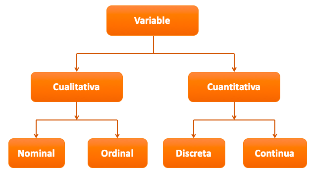

```{r setup, include=FALSE}
knitr::opts_chunk$set(echo = FALSE)
library(MASS)
library(psych)
library(knitr)
library(Rlab)
library(ggplot2)
library(xlsx)
library(readr)
library(readxl)
```


## **PLAN DE LA CLASE**

1. **Introducción**

- Variables aleatorias discretas: Observar y predecir.

- Variables aleatorias cualitativas: Observar y predecir.

- ¿Cómo exportar datos de R?.

2. **Práctica con R y Rstudio cloud**

- Observar y predecir variables aleatorias discretas con distribución Bernoulli o Binomial.

- Exportar datos de R a excel, txt y csv.

## **CLASIFICACIÓN DE VARIABLES**

```{r, echo=FALSE, out.width = '100%', fig.align='center'}

```

## **VARIABLES ALEATORIAS DISCRETAS**

- Son aquellas que presentan un número contable de valores discretos; por ejemplo:

* **Fecundidad medida como número de huevos**: (1, 15, 26, 50, etc.).

* **Número de parásitos** (1, 3, 5, 6, etc.).

* **Número de días a la muerte durante desafío contra patógenos** (1, 2, 3,..., 40).

* **Número de larvas**: (1, 15, 26, 50, etc.).

**Regla de oro: Si lo puede contar se puede tratar como una variable discreta.**

## **VARIABLES ALEATORIAS CUALITATIVAS**

- La variables cualitativas son aquellas que expresan una cualidad.

**ORDINALES**
* Color del salmón: Escala salmofan 20-34.

* Nivel de cataratas: Alto, Medio, Bajo.

* Infestación por caligus: Centro de Alta Diseminación (CAD) = o > 3 hembras Ovigeras; Centro normal < 3 hembras ovigeras.    

**NOMINALES**

* Sexo: Macho, hembra.

* Estado de madurez: Maduro, Inmaduro.

## ESTUDIO DE CASO: DAÑO BRANQUIAL

- Estudio de daño branquial por amebiasis, [Taylor et al. 2009](https://doi.org/10.1016/j.aquaculture.2009.01.030).

- Infection level : ¿Nominal u ordinal?.
- ¿Por qué Gill Score es una buena idea?

```{r, echo=FALSE, out.width = '80%' }

```


## **VARIABLES CUALITATIVAS: TABLAS Y MEDIAS**

- Recomendamos usar tablas de frecuencia para resumir información de variables cualitativas.
- Use media, varianza y desviación estándar apropiada a su variable.

```{r}
Gill <- read_excel("datos_all.xlsx", sheet=2)
knitr::kable(Gill, caption = "Tabla de frecuencia y cálculo de la media ponderada.", digits=2)
```

## OBSERVAR DISTRIBUCIÓN DE DAÑO BRANQUIAL

- Los cientificos de datos, usualmente tratan las variables cualitativas como discretas.
- Para variables cualitativas o discretas prefiera diagramas de barras.

```{r, echo=FALSE, out.width = '30%' }

```

## **DISTRIBUCIÓN BERNOULLI**

- La distribución de Bernoulli, describe un experimento aleatorio que sólo admite dos resultados excluyentes (éxito y fracaso). 

- El éxito es usualmente el evento de interes, a veces considerado como lo "malo": Muerte, enfermo, patógeno +.

- La variable aleatoria discreta $X$ asociada a este experimento toma el valor 1 cuando ocurre el suceso éxito con probabilidad $P(X=1)=p$ y el valor 0 cuando ocurre el suceso fracaso con probabilidad $P(X=0)=1-p$.


## **EJEMPLO VARIABLE CON DISTRIBUCIÓN BERNOULLI**

- Se saca un camarón al azar de una piscina, la probabilidad de que tenga síndrome de la mancha blanca es de 0.65. 
- Sea X=1 si el camarón tiene síndrome de la mancha blanca y X=0 en el caso de que no tenga síndrome de la mancha blanca. 
- ¿Cuál es la distribución de X?


|             | Fracaso | Éxito |
|-------------|---------|-------|            
| x           | 0       | 1     |
| f(x)=P(X=x) | 1-p     | p     |
|             | 0.35    | 0.65  |


## **DISTRIBUCIÓN BINOMIAL**

- Cuando se realizan $n$ pruebas de Bernoulli sucesivas e independientes, la variable aleatoria discreta $X$ toma una distribución binomial.

- X = "número de veces que ocurre el suceso éxito en n pruebas".

- Ejemplos
 a) Número de camarones que sufren síndrome de la mancha blanca en una finca.
 b) Número de parásitos en peces de cultivo.
 
## **VARIABLE DISCRETA CON DISTRIBUCIÓN BINOMIAL**

- Simulemos 10 ensayos aleatorios de parásitos que intentan infectar peces con una probabilidad de éxito del 1 sobre 10.

```{r,echo=FALSE, out.width = '80%', fig.align='center'}
set.seed(1)
x <- 0:10
prob <- dbinom(x,10,0.1)
barplot(prob,col = "darkolivegreen3",ylim = c(0,0.4),names.arg=x, main="Distribución esperada de parásitos con tasa de éxito del 10%.")
```

## **DISTRIBUCIÓN ACUMULADA DE PARÁSITOS.**

```{r,echo=FALSE, out.width = '80%', fig.align='center'}
plot(stepfun(0:10,pbinom(0:11,10,0.1)),xlab="Parásitos",ylab="Probabilidad acumulada.",main="Distribución acumulada (Binomial=10,0.6.)")
```

## ESTUDIO DE CASO: PARÁSITOS DE PECES

- Estudio distribución de piojos de salmon (Variable discreta) [Heuch et al. 2011](https://linkinghub.elsevier.com/retrieve/pii/S00448486110037960).

```{r, echo=FALSE, out.width = '80%' }

```

Fuente Imagen: [Thorstad et al. 2015](doi:10.3354/aei00142)

## OBSERVAR DISTRIBUCIÓN DE PARÁSITOS

- La distribución de la variable depende de la prevalencia.

```{r, echo=FALSE, out.width = '80%' }

```

## **COMO EXPORTAR DATOS DESDE R**

El paquete **Readr** es muy útil para exportar datos desde R a múltiples formatos.

```{r, echo=FALSE, out.width = '80%' }

```

## **PRÁCTICA OTRAS VARIABLES ALETORIAS**

**Guía de trabajo programación con R en Rstudio.cloud**.

```{r, echo=FALSE, out.width = '80%' }
knitr::include_graphics("Run.png")
```

## **RESUMEN DE LA CLASE**

- Identificamos  y clasificamos variables.

- Reconocemos variables aleatorias discretas y cualitativas.

- Simulamos y observamos distribuciones variables con probabilidad diferente de normal:  Bernoulli, Binomial, Binomial negativa.


