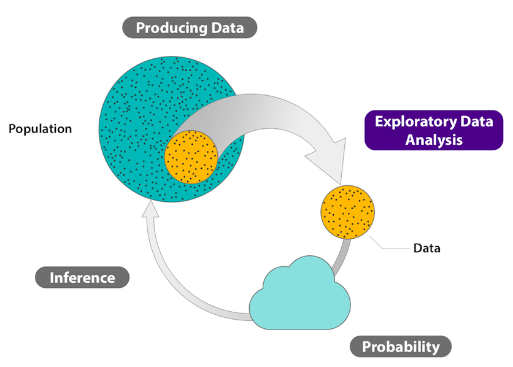
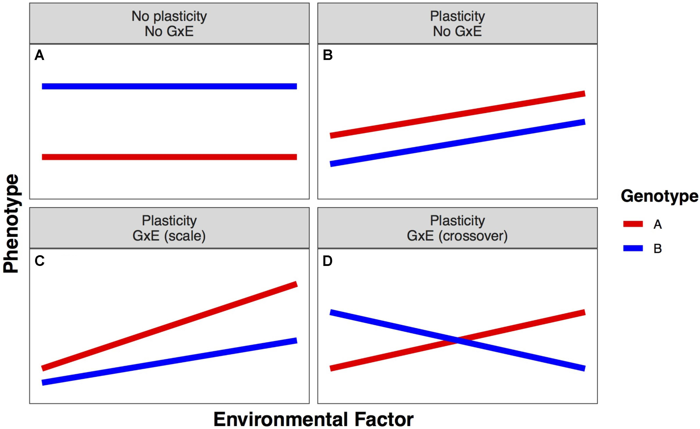
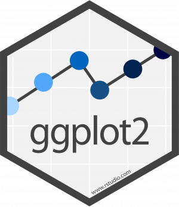

```{r setup, include=FALSE}
knitr::opts_chunk$set(echo = FALSE)
library(MASS)
library(psych)
library(ggplot2)
library(pander)
library(dplyr)
require(gridExtra)
library(grid)
```

## PLAN DE LA CLASE
**1.- Introducción**
    
- ¿Qué es un análisis exploratorio de datos (EDA en inglés)?.
- ¿Por qué es importante?.
- Preguntas importantes para realizar un buen EDA.
- Gráficas con ggplot2.

**2.- Práctica con R y Rstudio cloud**

- Realizar un análisis exploratorio de datos.
- Realizar gráficas avanzadas con ggplot2. 

## ANÁLISIS EXPLORATORIO DE DATOS (EDA)

**¿Qué es un análisis exploratorio de datos?**  
Procedimiento que permite visualizar y explorar las variables/datos de un estudio.  

```{r, echo=FALSE, out.width = '70%' , fig.align='center'}

```

## ¿POR QUÉ ES NECESARIO HACER UN EDA?

**Principalmente para:**  

1. Investigar calidad de los datos brutos.  

2. Limpiar datos.  

3. Observar variación de los datos.  

4. Establecer un modelo básico de relación e interacción entre variables.  

5. Seleccionar una prueba estadística adecuada.  

## EDA ES UN PROCESO ITERATIVO

**¿Cómo realizar un buen EDA?**

1. Genera preguntas iniciales para explorar tus datos.

2. Resume, visualiza, transforma y modela tus datos.

3. Usa lo que aprendiste para generar nuevas preguntas.

**Preguntas clave, pero no las únicas**  

- ¿Qué tipo de variación existe en la/s variables de estudio?  

- ¿Qué tipo de covariación o interacción existe entre las variables de estudio?  
- ¿Cuál es el modelo más simple que explica la relación entre variables?

- ¿Existen errores, datos faltantes, valores atípicos?

## EDA: IMPORTANCIA DE LA ESTRUCTURA DE LOS DATOS

**Diseño equilibrado o balanceado**: Todos los tratamientos son asignados a un número equivalente de unidades experimentales (observaciones).

**¿Datos son balanceados o desbalanceados?**  

```{r}
set.seed(123)
tilapia<-data.frame(chickwts)
sex<-rbinom(71, 1, 0.8)
dat<-data.frame(tilapia, sex)
dat$sex <- factor(dat$sex, labels=c("Male","Female"))
dat$feed <- factor(dat$feed, labels=c("D1", "D2", "D3", "D4", "D5", "D6"))
tabla<- table(dat$sex, dat$feed)

knitr::kable(tabla, caption = "Número de observaciones por sexo y dieta (D).")
# Exporta datos 
# write.table(dat, file="tilapia.xlsx", sep = ";", col.names = TRUE, dec=".")
```

Compare inferencia entre machos y hembras  
Compare inferencia entre dieta 6 y otras dietas  

## EDA: VARIACIÓN DENTRO DE UN FACTOR

**¿La variación de mis datos es homogenea?**

```{r, echo=FALSE, out.width = '90%' }
set.seed(123)

My_Theme = theme(
  axis.title.x = element_text(size = 18),
  axis.text.x = element_text(size = 18),
  axis.title.y = element_text(size = 18),
  axis.text.y = element_text(size = 18))


genotipo     <- rbinom(1000, 2, 0.5)
w.means <- c(3000, 3000, 3000) # Complete dominance
w.sd    <- c(200, 400, 800)
peso <- rnorm(1000, w.means[factor(genotipo)], w.sd[factor(genotipo)])
snp.w <- data.frame(cbind(genotipo, peso))

snp.w$genotipo<-as.factor(snp.w$genotipo)
snp.w$genotipo <- factor(snp.w$genotipo, labels=c("AA", "AC", "CC"))

g <- ggplot(snp.w, aes(x= genotipo, y = peso)) +
  geom_boxplot(aes(color = genotipo))+
  scale_color_manual(values = c("#00AFBB", "#E7B800", "blue")) +
  scale_fill_manual(values = c("#00AFBB", "#E7B800", "blue"))
g+My_Theme

```

## EDA: INTERACCIÓN ENTRE FACTORES

**¿Existe interacción entre los factores?**


```{r, echo=FALSE, out.width = '90%' }

```

## EDA: TAMAÑO DE LOS EFECTOS

**¿Qué factor tiene un mayor efecto sobre la variable respuesta?**

```{r}
plot.design(dat$weight ~ dat$sex + dat$feed, col = c(2), xlab="", xaxt="n", yaxt="n", ylab = "weight", cex.axis = 1.5)
axis(1, 1:2, c("Sex", "Feed"), cex.axis = 1.5)
axis(2, cex.axis = 1.5)
```
  
## EDA: CORRELACIÓN

**¿Existe covariación / correlación entre mis datos?**

```{r fig.cap="Distribución normal multivariada, out.width = '60%'"}
# Número de animales (n) y promedios (prom) de peso y filete
set.seed(123)
par(mfrow=c(1,2))
n <- c(20)
prom  <- c(10, 10)

# matriz de varianzas y covarianzas entre WFE y filete TrimD
covar <- matrix(c(3, 2.5, 2.5, 3), nrow = 2, ncol = 2)

# Crea muestra de variables correlacionadas
cor_pos <- data.frame(mvrnorm(n, prom, covar))
names(cor_pos) <- c("X", "Y")


cor_neg <- mutate(cor_pos,
  X = X,
  Y = Y * (-1))

set.seed(123)
par(mfrow=c(1,2))
X <- runif(n = 20,min = 0,max = 10)
Y <- rnorm(20, 10, 3)

set.seed(123)
X_1 <- 1:20
Y_1 <- (1/4) * X_1^2 # Funcion monotona creciente


layout(matrix(c(1,2,3,4),2,2,byrow = TRUE))
plot(cor_pos$X, cor_pos$Y, col ="blue", pch=20, xlab = "X", ylab = "Y", main = "Relación lineal positiva", cex.axis = 1.5,font=2)
abline(lm(cor_pos$Y ~ cor_pos$X), col="blue")
plot(cor_neg$X, cor_neg$Y, col ="red", pch=20, xlab = "X", ylab = "Y", main ="Relación lineal negativa", cex.axis = 1.5,font=2)
abline(lm(cor_neg$Y ~ cor_neg$X), col="red")
plot(X, Y, col ="green", pch=20, xlab = "X", ylab = "Y", main="Sin relación", font=2, cex.axis = 1.5)
plot(X_1, Y_1, type = 'b', pch=20, main = 'Relación no lineal', col = "dark red", lwd=2, font=2, cex.axis = 1.5, xlab = "X", ylab = "Y", ylim = c(0,120), xlim = c(0,20),cex.lab=0.75)

```


## GRÁFICAS CON GGPLOT2
\columnsbegin
\column{.8\textwidth}
**ggplot2**  
Paquete de visualización de datos preferido para realizar graficas con R [Wickham en 2005]()).

**Ventajas**  
- Gran flexibilidad.  
- Sistema para realizar gráficos completo y maduro.  
- Una gran comunidad de desarrolladores.  

**Características**  
- Los datos siempre deben ser un data.frame.  
- Usa un sistema diferente para añadir elementos al gráfico.  

\column{.2\textwidth}
```{r, echo=FALSE, out.width = '80%' }

```
\columnsend

## COMPARACIÓN GGPLOT2 - GRAPHICS

Comparación de algunos comandos de gráficas entre los paquetes **graphics** y **ggplot2**

| **Función**  |  **graphics** |  **ggplot2** |
|:---:|:---:|:---:|
|Función genérica para graficar |plot() |ggplot()|
|Histogramas |hist() |geom_histogram()|
|Gráfica de cajas y bigotes |boxplot()  |geom_boxplot()|
|Etiquetar ejes |xlab="" , ylab=""|labs(x="",y="")|


## ¿CÓMO FUNCIONA GGPLOT2?

**ggplot2 funciona por capas**

```{r, echo=TRUE, out.width = '80%' }
ggplot(CO2, aes(uptake))
```

## TEMAS CON GGPLOT2

Diversidad de [temas en ggplot2](https://ggplot2.tidyverse.org/reference/ggtheme.html)

```{r, echo=TRUE, out.width = '80%' }
ggplot(CO2, aes(uptake)) + theme_bw()
```

## HISTOGRAMAS CON GGPLOT2

```{r, echo=TRUE, out.width = '80%', message=FALSE}
ggplot(CO2, aes(uptake)) +
  geom_histogram(color="white", fill="blue", bins = 10) +
  theme_classic()
```

## CAMBIAR ETIQUETAS DE EJES

```{r, echo=TRUE, out.width = '70%', message=FALSE}
ggplot(CO2, aes(uptake))+
 geom_histogram(color="white", fill="blue", bins = 10)+
  labs(title="Histograma", x="Consumo de CO2", 
       y="Frecuencia") + theme_gray()
```

## CAMBIAR TAMAÑO DE ETIQUETAS

```{r, echo=TRUE, out.width = '70%', message=FALSE}

My_Theme = theme(
  axis.title.x = element_text(size = 18),
  axis.text.x = element_text(size = 18),
  axis.title.y = element_text(size = 18),
  axis.text.y = element_text(size = 18))

plot_1 <- ggplot(CO2, aes(uptake))+
 geom_histogram(color="white", fill="blue", bins = 10)+
  labs(x="Consumo de CO2", y="Frecuencia")

```


## HISTOGRAMA FINAL

```{r, echo=TRUE, out.width = '90%' }
plot_1 + My_Theme
```

## BOXPLOT CON GGPLOT2

```{r, echo=TRUE, out.width = '80%', message=FALSE}
ggplot(CO2, aes(x=Treatment, y=uptake))+
 geom_boxplot(color="blue")+
  labs( x="Tratamiento", y="Consumo de CO2") + My_Theme
```


## RESUMEN DE LA CLASE

1. Importancia de los análisis exploratorio de datos.  
        
2. Preguntas importantes de un EDA:      
  2.1 Variación en mis variables de estudio.        
  2.2 Covariación e interacción entre mis variables de estudio.       
  2.3 Modelo más simple que explica la relación entre variables.        
  2.4 Errores, datos faltantes, valores atípicos.       
          
3. Realizamos gráficas avanzadas con ggplot2.       
  3.1 Histograma y boxplot.       
