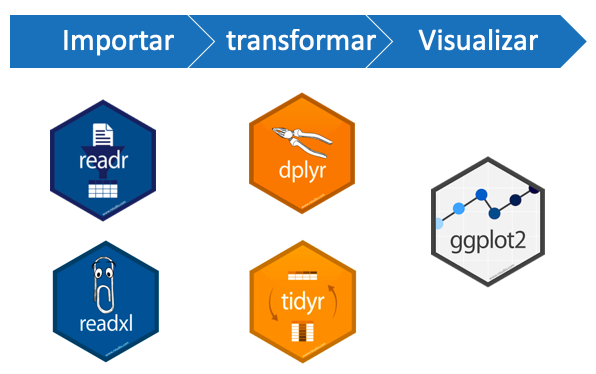
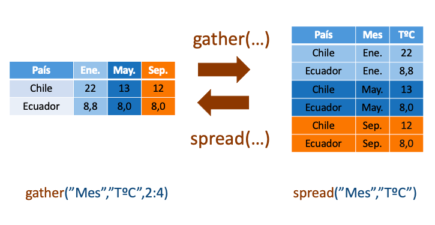
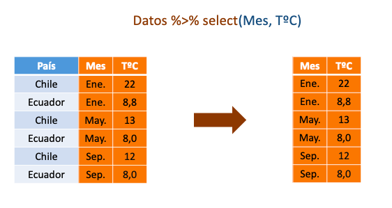
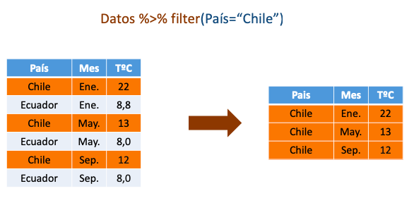
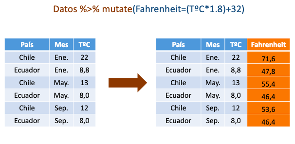
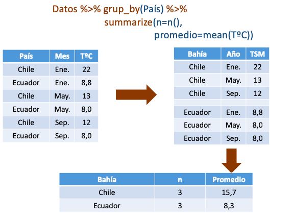
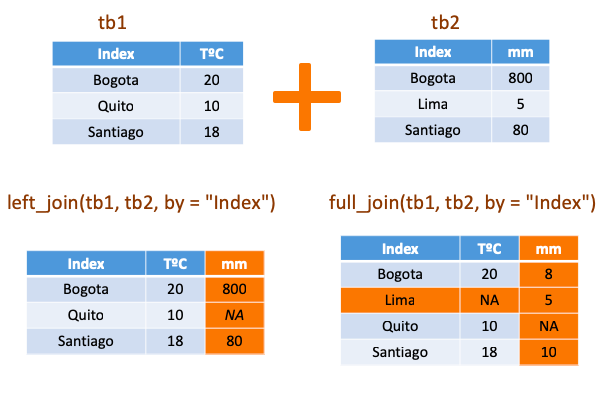

```{r setup, include=FALSE}
knitr::opts_chunk$set(echo = FALSE)
library(dplyr)
library(readxl)
library(ggplot2)
library(tidyr)
```

# PLAN DE LA CLASE

## **1.- Introducción**
    
- ¿Para qué manipular datos?
- Diferencia entre Tidy and messy data.
- Paquete tidyr.
- Operador pipe (Tuberías).
- Paquete dplyr. 

## **2). Práctica con R y Rstudio cloud.**

- Realizar manipulación de datos con tidyr y dplyr.
- Realizar gráficas avanzadas con ggplot2.

# MANIPULACIÓN DE DATOS

## **¿Para qué manipular datos?**
- Para hacer datos más legibles y organizados.  
- Para dar formato adecuado previo a visualización y análisis estadístico. 

### Ejemplos de tareas comunes durante esta etapa:

* Filtrar datos por categorías.

* Remover o imputar datos faltantes.

* Agrupar datos por algún criterio.

* Seleccionar y calcular estadísticos.

* Generar variables derivadas a partir de variables existentes. 

* Transformar variables.

# ETAPAS DEL ANÁLISIS DE DATOS

```{r, echo=FALSE, out.width = '100%', fig.align='center'}

knitr::include_graphics("data-science-explore.png")
```

# PAQUETES CLAVE

```{r, echo=FALSE, out.width = '100%', fig.align='center'}


```

# DATOS TIDY - MESSY

**Tidy data (datos ordenados)**  

- Cada columna es una variable.  
- Cada fila es una observación.  
- Cada celda es un simple dato o valor.  

**Messy data (desordenados)**  

- Cualquier conjunto de datos que no cumple alguno de estos criterios.  

# EJEMPLO DATOS MESSY

**¿Por qué son messy?**

| Variable	| Replica |	Especie A	| Especie B	| Especie C |
|:---:|:---:|:----:|:-----|:---:|
|peso |	1	|174	|NA	|135 |
|peso	| 2	|155	|103	|138|
|peso	| 3	|131	|138	|135|
|parásitos	|1	|25	|8	|5|
|parásitos	|2	|12	|3	|8|
|parásitos	|3	|4	|11	|NA|

# EJEMPLO DATOS TIDY

**¿Por qué son tidy?**

| Pez | Especie | Sexo | Peso |  Parásitos |
|:---:|:---:|:----:|:-----|:---:|
| 1  | A   | Hembra | 174    |  25 |
| 2  | A   | Hembra | 155    | 12 |
| 3  | A   | Hembra | 131    |  4 |
| 4  | B   | Macho |   NA  |  8 |
| 5  | B   | Macho | 103    | 3  |
| 6  | B   | Hembra | 138    |  11 |
| 7 | C   | Hembra | 135    | 5  |
| 8  | C   | Macho | 138    | 8  |
| 9 | C   | Hembra | 135    |  NA |

# EL OPERADOR PIPE: %>%.

En programación **pipe** es una técnica que permite pasar información de un proceso o programa a otro por etapas.

Evita pipe cuando:
a) Deseas manipular varios objetos a la vez.
b) Un paso intermedio genera un objeto que luego deseas analizar separadamente.

```{r, echo=FALSE, out.width = '80%', fig.align='center'}

knitr::include_graphics("pipe.png")
```


# PAQUETE TIDYR: FUNCIONES CLAVE

**gather()**: Colapsa múltiples columnas para crear tidy data.
**spread()**: Separa una columna en múltiples columnas.

```{r, echo=FALSE, out.width = '100%', fig.align='center'}


```


# PAQUETE DPLYR: FUNCIONES BÁSICAS

**select()**: Permite extraer o seleccionar variables/columnas específicas de un data.frame.

**filter()**: Para filtrar desde una tabla de datos un subconjunto de filas. Ej. solo un nivel de un factor, observaciones que cumplen algún criterio (ej. > 20).

**mutate()**: Permite calcular/generar nuevas variables "derivadas". Útil para calcular proporciones, tasas.

**arrange()**: Permite ordenar la base de datos según una variable de forma ascendente o descendente.

# PAQUETE DPLYR: SELECT()


```{r, echo=FALSE, out.width = '100%', fig.align='center'}


```


# PAQUETE DPLYR: FILTER()


```{r, echo=FALSE, out.width = '100%', fig.align='center'}


```

# PAQUETE DPLYR: MUTATE()


```{r, echo=FALSE, out.width = '100%', fig.align='center'}


```

# PAQUETE DPLYR: FUNCIONES AVANZADAS

**group_by()**: Permite agrupar filas con base a los niveles de alguna variable o factor.

**summarize()**: Permite obtener medidas resumen de las variables.

**inner_join()**: Permite unir 2 data.frames con las filas que tienen información en ambas tablas usando una variable índice.

**full_join()**: Permite unir 2 data.frames con todas las filas.

**left_join()**: Permite unir 2 data.frames con todas las filas de la primera tabla, si no hay datos conmpleta con NA.

**right_join()**: Permite unir 2 data.frames con todas las filas de la segunda tabla, si no hay datos conmpleta con NA.

# PAQUETE DPLYR: GROUP_BY + SUMMARIZE()

```{r, echo=FALSE, out.width = '90%', fig.align='center'}


```

# PAQUETE DPLYR: JOIN DATA FRAME

```{r, echo=FALSE, out.width = '100%', fig.align='center'}


```

# R FOR DATA SCIENCE


- Lectura recomendada [R for data science en español](https://es.r4ds.hadley.nz/) de de Hadley Wickham y Garrett Grolemund.

```{r, echo=FALSE, out.width = '100%', fig.align='center'}

knitr::include_graphics("Rdata_science.png")
```


# RESUMEN DE LA CLASE

- Diferenciamos datos ordenados (Tidy) y desordenados (Messy).

- Manipulamos datos con tidyr y dplyr.

- Utilizamos tuberías o pipe **%>%**.

- Hicimos gráfico ggplot2 usando datos transformados y variables derivadas.
