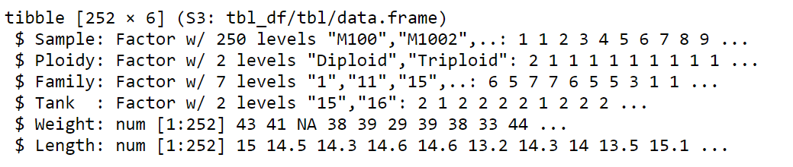
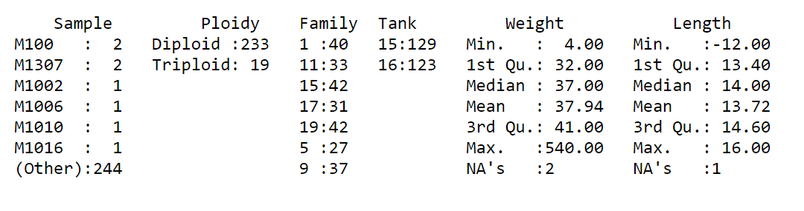

```{r setup, include=FALSE}
knitr::opts_chunk$set(echo = FALSE)
library(dplyr)
library(readxl)
library(ggplot2)
library(tidyr)
library(knitr)
library(kableExtra)
library(zoo)
library(gridExtra)

```

# PLAN DE LA CLASE

## **1.- Introducción**
    
- Limpieza de datos.
- Funciones comunes para limpieza de datos.
- Funciones avanzadas para limpieza de datos.
- Gráficas en panel: una o más variables.    

## **2). Práctica con R y Rstudio cloud.**

- Realizar manipulación de datos con tidyr y dplyr.
- Realizar gráficas avanzadas con ggplot2.

# TAREAS COMUNES DE LA LIMPIEZA DE DATOS:

- Identificar y tratar valores duplicados y atípicos.

- Tratar valores faltantes mediante la eliminación o la imputación.

- Normalizar/estandarizar las variables para que estén en una escala común.

- Anonimizar datos personales.

- Verificar la consistencia y la integridad de los datos.

# IMPORTANCIA DE LA LIMPIEZA DE DATOS

## **¿Por qué es importante la limpieza de datos?**

- Mejora la precisión y eficiencia del análisis.

- Mejora la toma de decisiones.

- Identifica patrones y tendencias ocultas en los datos.

- Cumplir con regulaciones y normativas de protección de datos.

- Mejora la estimación de parámetros estadísticos lo que reduce costos.

# PROBLEMÁTICAS COMUNES DEL ANALISTA DE DATOS

- **Valores faltantes**: Eliminar observaciones (filas) o imputar valores faltantes.
- **Valores atípicos**: Identificarlos (Boxplot) y tratarlos adecuadamente (eliminar o corregir).
- **Datos inconsistentes**: diferentes fuentes, como errores de entrada de datos o diferencias en la forma en que se registran los datos.
- **Datos duplicados**: pueden surgir de la combinación de diferentes conjuntos de datos o errores en la entrada/codificación de los datos.
- **Datos desactualizados**: Actualizar regularmente para garantizar la precisión y la calidad de los datos.
- **Falta de documentación**: Realizar documentación detallada sobre el proceso de la limpieza y la manipulación de los datos.


# FUNCIONES DE R QUE PODEMOS USAR EN LA LIMPIEZA DE DATOS

- Verificar la estructura de los datos utilizando ```str()```
- Obtener vista previa de los datos ```head()```
- Verificar la consistencia y la integridad de los datos mediante la función ```summary()```
- Identificar valores atípicos o extremos mediante gráfico **boxplot()**

# FUNCIONES AVANZADAS DE R QUE PODEMOS USAR EN LA LIMPIEZA DE DATOS

- Identificar y tratar valores faltantes ```is.na()```
- Eliminar filas de datos faltantes ```na.omit()```
- Imputar valores faltantes ```replace_na()```
- Identificar y tratar valores duplicados ```duplicated()```
- Unificar datos duplicados ```distinct()`` 
- Normalizar/estandarizar los datos para ajustarlos a una escala común ```scale()``` o ```normalize()```

# PAQUETES CLAVE

```{r, echo=FALSE, out.width = '100%', fig.align='center'}

knitr::include_graphics("paquetes.png")
```

# PASOS DE LIMPIEZA DE DATOS

## Base de datos de salmones con **252** observaciones (filas) y **6** variables (columnas).

- Revisar si hay datos faltantes (NA), duplicados o atípicos.

```{r, echo=FALSE}
salmon <- read_excel("salmon.xlsx", na = "NA")
salmon <- salmon%>% 
          arrange(Sample)

kable(head(salmon,10), linesep = "")%>%
  kable_styling("striped", full_width = FALSE) %>%
  row_spec(c(1, 2), background = "#99FFCC")%>%
  row_spec(3, background = "#FFA07A")
```

# ESTRUCTURA DE LA BASE DE DATOS

- Verificar la estructura de los datos utilizando **```str()```**

- Transformar variables que están en formato **_chr_** a **_factor_** con **```as.factor()```**

- Transformar a variable númerica con **```as.numeric()```**

```{r, echo=FALSE}
salmon <- read_excel("salmon.xlsx", na = "NA")
salmon <- salmon%>% 
          arrange(Sample)

salmon$Sample <- as.factor(salmon$Sample)
salmon$Ploidy <- as.factor(salmon$Ploidy)
salmon$Family <- as.factor(salmon$Family)
salmon$Tank <- as.factor(salmon$Tank)
```


```{r, echo=FALSE, out.width = '100%', fig.align='center'}

```


# IDENTIFICACIÓN DE NAs

- Revisar si hay datos faltantes (NA), atípicos, duplicados con **```summary()```**.

**```summary(salmon)```**

```{r, echo=FALSE, out.width = '100%', fig.align='center'}

```


# ELIMINACIÓN DE NAs

- Dimensión de la base de datos con datos faltantes

```{r, echo=FALSE}
salmon <- read_excel("salmon.xlsx", na = "NA")
salmon$Sample <- as.factor(salmon$Sample)
salmon$Ploidy <- as.factor(salmon$Ploidy)
salmon$Family <- as.factor(salmon$Family)
salmon$Tank <- as.factor(salmon$Tank)
salmon_new <- na.omit(salmon)
dim(salmon)

```

**```dim(salmon)```**

- Omitir/quitar datos faltantes **```na.omit()```**

**```salmon_new <- na.omit(salmon)```**

- Dimensión de la nueva base de datos sin datos faltantes 

**```dim(salmon_new)```**

```{r, echo=FALSE}
salmon <- read_excel("salmon.xlsx", na = "NA")
salmon$Sample <- as.factor(salmon$Sample)
salmon$Ploidy <- as.factor(salmon$Ploidy)
salmon$Family <- as.factor(salmon$Family)
salmon$Tank <- as.factor(salmon$Tank)
salmon_new <- na.omit(salmon)
dim(salmon_new)

```


# REEMPLAZAR/IMPUTAR NAs

Reemplazar datos faltantes por la media, mediana, etc **```replace_na()```**

**```salmon <- salmon%>% mutate(Weight = replace_na(Weight,median(Weight, na.rm = TRUE)),Length = replace_na(Length,median(Length, na.rm = TRUE)))```**

```{r, echo=FALSE}
salmon <- read_excel("salmon.xlsx", na = "NA")
salmon$Sample <- as.factor(salmon$Sample)
salmon$Ploidy <- as.factor(salmon$Ploidy)
salmon$Family <- as.factor(salmon$Family)
salmon$Tank <- as.factor(salmon$Tank)

salmon <- salmon%>% 
          arrange(Sample)
salmon <- salmon%>% mutate(Weight = replace_na(Weight,median(Weight, na.rm = TRUE)),
                           Length = replace_na(Length,median(Length, na.rm = TRUE)))

kable(head(salmon,4), linesep = "")%>%
kable_styling("striped", full_width = FALSE)%>%
row_spec(3, background = "#FFA07A")
```


# IDENTIFICAR DATOS DUPLICADOS

Revisar si hay observaciones duplicadas con **```duplicated()```**

* La información en todas las columnas está duplicada

**```dups_all <- salmon %>% filter(duplicated(.))```** 

```{r, echo=FALSE, out.width = '100%', fig.align='center'}
dups_all <- salmon %>% filter(duplicated(.))
kable(head(dups_all), linesep = "")%>%
kable_styling("striped", full_width = FALSE)%>%
row_spec(1, background = "#FFB90F")
```

* Las observaciones están duplicadas para el mismo individuo

**```dups_id <- salmon %>% filter(duplicated(Sample))```**

```{r, echo=FALSE, out.width = '100%', fig.align='center'}
dups_id <- salmon %>% filter(duplicated(Sample))
kable(head(dups_id), linesep = "")%>%
kable_styling("striped", full_width = FALSE)%>%
row_spec(1, background = "#1E90FF")%>%
row_spec(2, background = "#FFA07A")  
```

# UNIFICAR DATOS DUPLICADOS

Corregir o unificar datos duplicados **```distinct()```**

**```salmon_unified <- salmon %>% distinct(Sample, .keep_all = TRUE)```**

```{r, echo=FALSE, out.width = '100%', fig.align='center'}
salmon_unified <- salmon %>% distinct(Sample, .keep_all = TRUE)

kable(head(salmon_unified,4), linesep = "")%>%
kable_styling("striped", full_width = FALSE)%>%
row_spec(1, background = "#FFD39B")
```
    

```{r,echo=FALSE, message=FALSE, error=FALSE, warning=FALSE}
#salmon <- read_excel("salmon.xlsx", na = "NA")
#salmon$Sample <- as.factor(salmon$Sample)
#salmon$Ploidy <- as.factor(salmon$Ploidy)
#salmon$Family <- as.factor(salmon$Family)
#salmon$Tank <- as.factor(salmon$Tank)

#salmon <- salmon%>% 
#          arrange(Sample)
#salmon <- salmon%>% mutate(Weight = replace_na(Weight,median(Weight, na.rm = TRUE)),
#                           Length = replace_na(Length,median(Length, na.rm = TRUE)))

#dups_all <- salmon %>% filter(duplicated(.))


#dups_id <- salmon %>% filter(duplicated(Sample))


#salmon_unified <- salmon %>% distinct(Sample, .keep_all = TRUE)
#head(salmon_unified,4)
```


# VISUALIZAR POR NIVEL DE UN FACTOR

**```facet_wrap()```**: Permite dividir una gráfica en paneles o subgráficos basados en una o varias variables categóricas.  


```{r,echo=FALSE, message=FALSE, error=FALSE, warning=FALSE}
salmon <- read_excel("salmon.xlsx", na = "NA")
salmon$Sample <- as.factor(salmon$Sample)
salmon$Ploidy <- as.factor(salmon$Ploidy)
salmon$Family <- as.factor(salmon$Family)
salmon$Tank <- as.factor(salmon$Tank)

salmon <- salmon%>% 
          arrange(Sample)
salmon <- salmon%>% mutate(Weight = replace_na(Weight,median(Weight, na.rm = TRUE)),
                           Length = replace_na(Length,median(Length, na.rm = TRUE)))

salmon_unified <- salmon %>% distinct(Sample, .keep_all = TRUE)
salmon_mod <- salmon_unified %>%
              mutate(Weight = ifelse(Sample == "M12", 54, Weight))

```

```{r, echo=FALSE,out.width = '90%', fig.align='center'}
ggplot(salmon_unified, aes(x = Family, y = Weight, fill = Ploidy)) + 
  geom_boxplot() +
  scale_fill_manual(values = c("turquoise", "coral")) +
  facet_wrap(~ Ploidy) +
  labs(title = "Weight distribution by family and ploidy level",
       x = "Family",
       y = "Weight (g)") +
  theme_bw() +
  geom_text(data = filter(salmon_unified, Weight > quantile(Weight, 0.75) + 1.5*IQR(Weight)),
            aes(label = Sample), hjust = -0.2, vjust = 0.5)

```

# GRÁFICOS EN PANEL

**```grid.arrange(p, q, r, ncol = 3)```** : se utiliza para combinar varios gráficos de ggplot en una sola figura.

```{r, echo=FALSE, out.width = '90%', fig.align='center'}
theme_customizado <-  theme(axis.text.x = element_text(size = 12, face = "bold", hjust = 0.5, vjust = 0.5), 
                            plot.margin = unit(c(1,0.5,1,1), "cm"))

p <- ggplot(salmon_unified, aes(x = Weight)) + 
  geom_histogram(fill="coral", bins=30) +
  theme_bw()+
  theme_customizado

q <- ggplot(data = salmon_unified, aes(x = reorder(Family, Weight, FUN = mean), y = Weight))+
  geom_boxplot(fill="darkolivegreen1")+
  labs(x="Families", y="Weight (g)")+ 
  geom_hline(yintercept = mean(salmon_unified$Weight), linetype = "solid", color = "blue")+
  theme_bw()+
  theme_customizado


r <- ggplot(data = salmon_mod, aes(x = reorder(Family, Weight, FUN = mean), y = Weight))+
  geom_boxplot(fill="cyan3")+
  labs(x="Families", y="Weight (g)")+ 
  geom_hline(yintercept = mean(salmon_mod$Weight), linetype = "solid", color = "blue")+
  theme_bw()+
  theme_customizado


grid.arrange(p, q, r, ncol = 3)

```


# RESUMEN DE LA CLASE

- Identificamos valores atípicos, duplicados y faltantes.

- Usamos funciones avanzadas para unificar valores duplicados, imputación de datos faltantes y modificación de valores atípicos.

- Utilizamos tuberías o pipe **%>%**.

- Hicimos gráficos ggplot2 usando funciones de manipulación avanzada de datos.

