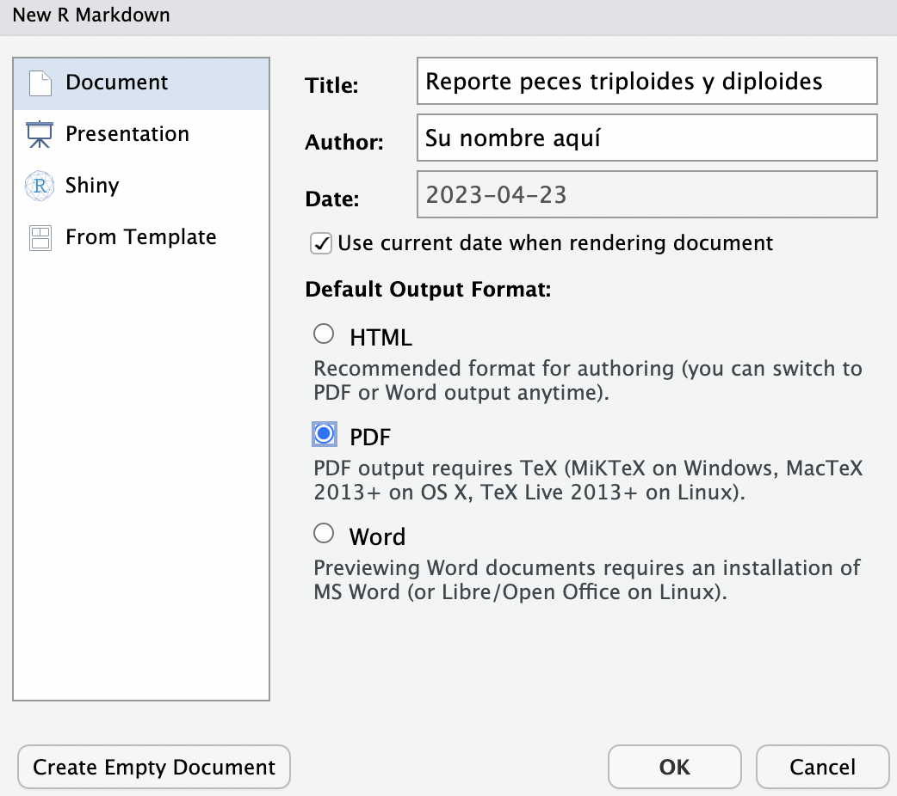

<style>
#TOC {
  color: black;
  font-familiy: Calibri;
  font-size: 14px;
  border-color: #708090; 
}
body {
   color: black;
   font-familiy: Calibri;
}

pre {
  color: black;
  background-color: #F8F8FF;
}
# header {
  color: #800000;
  font-familiy: Calibri;
  background-color: #F5F5F5;
  opacity: 0.8;
  font-size: 16px;
}
</style>

### **Introducción**

¿Qué es Rmarkdown?

**Markdown** es un lenguaje de marcado ligero creado por John Gruberis en 2004, con el se pueden elaborar fácilmente documentos en formato HTML, PDF y MS Word. Para más detalles de como trabajar con Markdown explore el siguiente link  <https://es.wikipedia.org/wiki/Markdown>.

[**Rmarkdown**](https://rmarkdown.rstudio.com/) es un procesador de texto que permite la creación de reportes, informes, documentos o presentaciones de alta calidad para sus usuarios o clientes. RMarkdown no sería posible de imaginar sin el desarrollo previo y la integración de varios **_software_** como **Markdown** y **YAML** o librerías de **R** como **knitr**.

Una de las versatilidades de **Rmarkdown** es que puede pasar de analizar sus datos, a realizar un reporte profesional para sus usuarios o clientes sin necesidad de copiar o pegar a otro documento o usar otro software. 

[**_knitr_**](https://yihui.org/knitr/) es el paquete clave que utiliza **Rmarkdown** puede generar reportes dinámicos. **knitr** fue desarrollada por Yihui Xie en 2012 y su contribución a la investigación reproducible ha sido significativa.

**[YAML](https://es.wikipedia.org/wiki/YAML)** es un lenguaje simple de programación que permite describir datos. Se usa como herramienta para configurar el **metadata** de un reporte dinámico en Rmarkdown. 

**¿Cómo funciona?**

Respecto de un **_script_** tradicional de **R**, los script de Rmarkdown presentan tres diferencias: 

**1**. La extensión del archivo es **.Rmd**.

**2**. La codificación de la metadata está a cargo del software **YAML** y le indica a **knitr** no sólo que tipo de documento generar (Html, word, pdf, PPT); sino también, cual será el formato global y específico del documento (tamaño de letra, color, etc).

**3**. Los códigos se deben incluir en bloques, también llamados **Chunk**. Los chunk pueden tener un nombre identificador y mediante algunos argumentos específicos definir las características de ese bloque en particular, como por ejemplo, que el código se incluya o no en el reporte, o para agregar alguna leyenda a las figuras.

Use esta [Hoja de referencia](https://www.rstudio.com/wp-content/uploads/2015/02/rmarkdown-cheatsheet.pdf) como ayuda para elaborar reportes Rmarkdown.

Use está guía de sintaxis de **Markdown** para mejorar el estilo de sus documentos [Rmarkdown](https://rstudio-pubs-static.s3.amazonaws.com/330387_5a40ca72c3b14824acedceb7d34618d1.html).

### **Objetivos de aprendizaje**

Los objetivos de aprendizaje de esta guía son:

**1**. Iniciar un proyecto de análisis de datos y escribir un código de programación o **_script_** con **[Rmarkdown](https://rmarkdown.rstudio.com/)**.

**2**. Elaborar reportes dinámicos con **Rmarkdown**.

### **Ejercicios**

En esta guía elaboraremos un reporte dinámico en formato pdf, word y html usando los datos de peces diploides y triploides de salmón del Atlántico obtenido desde la investigación realizada por ([Harvey et al., 2017](https://doi.org/10.1186/s12863-017-0502-x). 

### **Ejercicio 1.** **Cree su propio reporte de análisis de datos con Rmarkdown.**

Cree un **_script_** para elaborar un reporte usando la barra de herramientas de **Rstudio**. Seleccione **File > New file > R Markdown** y utilice el siguiente ejemplo para completar la información de **YAML - metadatos**: Título, nombre del autor y formato, seleccione pdf.

```{r, echo=FALSE, out.width = '55%' }

```

Luego guarde inmediatamente su script como **script_Rmarkdwon_nombre_apellido.Rmd**.  

### **Ejercicio 2.**  **Configuración del reporte.**

En el primer bloque de códigos o **chunk** asegúrese de que los comandos están configurados de la siguiente manera *knitr::opts_chunk$set(echo = TRUE)*. Luego cargue los paquetes **readxl**, **dplyr** y **ggplot2** usando la función library().

```{r setup, include=TRUE, warning=FALSE, message=FALSE}
knitr::opts_chunk$set(echo = TRUE)
library(readxl)
library(dplyr)
library(ggplot2)
library(knitr)

```


### **Ejercicio 3.** **Importar datos**

Importe los datos a R desde el archivo excel **salmon.xlsx**.

```{r, echo=TRUE}
datos_salmon <- read_excel("salmon.xlsx", sheet=1)
```


### **Ejercicio 4.** **Introducción y métodos**

Escriba un pequeño párrafo de introducción que de contexto a su reporte y detalle los métodos que usted usó en la clase 6 para explorar los datos. Refierase al proceso de eliminación de datos repetidos, valores atípicos y valores perdidos. De formato a los Títulos con ## , use texto en negrita con ** y cursiva con *.

    ## Introducción
    
    **Lorem ipsum dolor sit amet**, consectetur adipiscing elit, sed do eiusmod tempor incididunt ut labore et dolore magna aliqua. Ut enim ad minim veniam, quis nostrud exercitation ullamco laboris nisi ut aliquip ex ea commodo consequat.
    
    ## Métodos
    
    *Duis aute irure dolor* in reprehenderit in voluptate velit esse cillum dolore eu fugiat nulla pariatur. Excepteur sint occaecat cupidatat non proident, sunt in culpa qui officia deserunt mollit anim id est laborum.

```{r, echo=FALSE}
tidy_salmon <- na.omit(datos_salmon)

```


### **Ejercicio 4.** **Resultados.**

Presente y explique los resultados con gráficas y tablas resumen. Integre texto **Markdown** con los códigos de programación utilizados en la clase 6. 

```{r}
tabla <- table(tidy_salmon$Family, tidy_salmon$Ploidy)

kable(tabla, caption = "Ejemplo de tabla resumen peces diploides y triploides por familia.")

```

```{r, echo=TRUE, fig.cap="Ejemplo figura de barras."}
tidy_salmon %>% ggplot(aes(x= Ploidy, fill=Ploidy))+
   geom_bar()
```

### **Ejercicio 05.** **Render reportes dinámicos**

Finalmente imprima diferentes versiones de su reporte (pdf, word, html) con el botón **Knit**.


