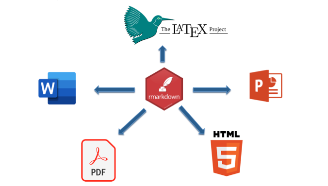
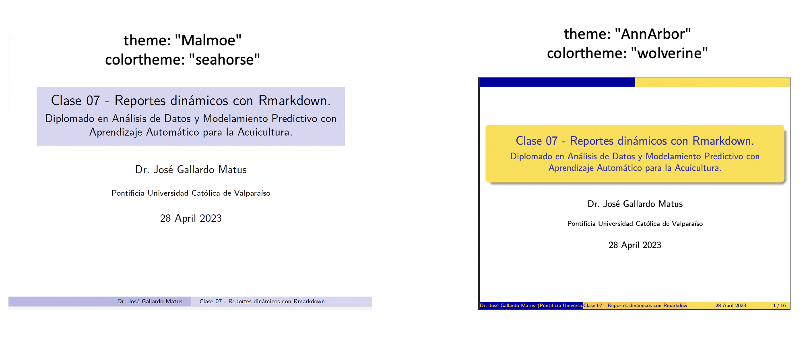

```{r setup, include=FALSE, comment=TRUE}
knitr::opts_chunk$set(echo = FALSE)
```

## **PLAN DE CLASE**

**1).** **Introducción**

- Paradigmas para elaborar reportes: WYSIWYG v/s WYSIWYM

- ¿Qué es markdown y para que sirve?

- Ejemplo sintaxis de Markdown.

- ¿Qué es Rmarkdown y para que sirve?.

- Integración con YAML y LATEX.

**2).** **Práctica con R y Rstudio cloud**

- Familiarizarse con sintaxis de Markdown.

- Elaborar reportes dinámicos con Rmarkdown.

## FORMAS DE CREAR REPORTES: WYSIWYG

- **What You See Is What You Get**  
Word, Power Point, pdf, otros.

```{r, echo=FALSE, out.width = '80%', fig.align='center'}

```

[@2022. The Free On-line Dictionary of Computing](https://encyclopedia2.thefreedictionary.com/What-you-see-is-what-you-get)

## FORMAS DE CREAR REPORTES: WYSIWYM

- **What You See Is What You Mean (WYSIWYM)**.  
HTML, Latex, Markdown

```{r, echo=FALSE, out.width = '80%', fig.align='center'}

```

## ¿QUÉ ES MARKDOWN?

- Markdown es un lenguaje de programación que permite editar y automatizar textos complejos para publicarlo en multiples formatos (HTML, Word, Pdf, PPT). Similar a Latex, permite reproducibilidad.

```{r, echo=FALSE, out.width = '80%', fig.align='center'}

```

## EJEMPLO SINTAXIS MARKDOWN

```{r, echo=FALSE, out.width = '80%', fig.align='center'}

```

[Markdown preview](https://markdownlivepreview.com/)

## ¿QUÉ ES RMARKDOWN?

- Rmarkdown es un procesador de texto que permite la creación de reportes de alta calidad integrando texto con códigos de programación R. 

```{r, echo=FALSE, out.width = '100%', fig.align='center'}
knitr::include_graphics("Rmarkdown.png")
```

## TIPOS DE REPORTES CON RMARKDOWN

```{r, echo=FALSE, out.width = '100%', fig.align='center'}

``` 

## FLUJO DE TRABAJO R MARKDWON

```{r, echo=FALSE, out.width = '100%', fig.align='center'}

```

## RMARKDOWN - REPORTE PDF

```{r, echo=FALSE, out.width = '70%', fig.align='center'}
knitr::include_graphics("Reporte_pdf.png")
```

## RMARKDOWN - PRESENTACIÓN BEAMER

```{r, echo=FALSE, out.width = '70%', fig.align='center'}

```

## YAML HEADER (METADATA)

- YAML es un lenjuage de programación que permite configurar la presentación de los archivos creados con Rmarkdown.

```{r, echo=FALSE, out.width = '100%', fig.align='center'}
knitr::include_graphics("YAML.png")
```


## INTEGRACIÓN CON LATEX

LATEX (pronunciado “LAY-tek”) es una herramienta para componer documentos de apariencia profesional muy usando en el ámbito científico.

El siguiente documento, edita una presentación beamer para permitir añanir columnas dentro de una diapositiva y para que la numeracion de tablas sea en español.

```{r, echo=FALSE, out.width = '100%', fig.align='center'}

```

## BEAMER Y LATEX

```{r, echo=FALSE, out.width = '110%', fig.align='center'}

```
Enlaces de plantillas beamer:  
[Tutorial beamer](https://latex-beamer.com/tutorials/beamer-themes/) y 
[Beamer themes](https://mpetroff.net/files/beamer-theme-matrix/)

## RENDER - PRESENTACIÓN

```{r, echo=FALSE, out.width = '100%', fig.align='center'}

```
 
##  **RESUMEN DE LA CLASE**

- Paradigmas: WYSIWYG v/s WYSIWYM.

- Markdown y sintaxis.

- Rmarkdown y flujo de trabajo.

- Render (presentar) diferentes formatos: word, pdf, html, beamer.

