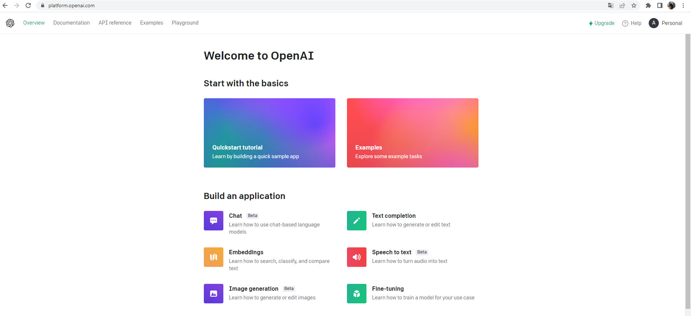

```{r setup, include=FALSE}
knitr::opts_chunk$set(echo = FALSE)
library(dplyr)
library(readxl)
library(ggplot2)
library(tidyr)
library(knitr)
library(zoo)
library(gridExtra)
```

# PLAN DE LA CLASE

## **1.- Introducción**
    
- ¿Qué es inteligencia artificial?
- ¿Qué es GPT?
- ¿Cómo se desarrolló GPT?
- IA usando Platform, Chat open AI y RStudio
- ¿Cómo sirve la IA para análisis en ciencias de datos?

## **2). Práctica con R y Rstudio cloud.**

- Realizar manipulación de datos usando IA.
- Realizar gráficas avanzadas con ggplot2 desde interface de IA.

# ¿CUÁNDO FUERON LOS INICIOS DE LA INTELIGENCIA ARTIFICIAL (IA)?

- La inteligencia artificial (IA) como campo de estudio y desarrollo fue iniciada por varios pioneros de la informática y la matemática en la década de 1950. 

- Entre los primeros contribuyentes destacan nombres como John McCarthy, Marvin Minsky, Claude Shannon, Allen Newell y Herbert Simon. Sin embargo, es importante destacar que la IA es el resultado de un esfuerzo colectivo de muchos investigadores y científicos a lo largo de varias décadas.


# ¿QUÉ ES INTELIGENCIA ARTIFICIAL (IA)?

La inteligencia artificial (IA) es un campo de la informática que se enfoca en el desarrollo de algoritmos y sistemas que pueden realizar tareas que típicamente requieren inteligencia humana, como el aprendizaje, la percepción, el razonamiento y la resolución de problemas.


# EJEMPLOS DE LA APLICACIÓN DE LA IA EN ACUICULTURA

La IA se está utilizando cada vez más en la acuicultura para mejorar la producción, la eficiencia y la sostenibilidad. 

Algunos ejemplos incluyen:

- El monitoreo de la calidad del agua 

- La identificación de enfermedades

- El modelado de sistemas de acuicultura 

- La predicción de la demanda del mercado.

# ¿QUÉ ES GPT?

- **GPT** significa "**G**enerative **P**re-trained **T**ransformer".

- Es una arquitectura de red neuronal desarrollada por [**OpenAI**](https://chat.openai.com/)

- Se enfoca en la generación de lenguaje natural y el procesamiento del lenguaje natural.

- GPT-3 es la versión más reciente de la arquitectura GPT y es una de las redes neuronales más grandes y potentes que existen.

- Ha sido entrenado en una cantidad masiva de datos, lo que le permite realizar tareas sorprendentes como responder preguntas, generar texto creativo, traducir idiomas, entre otras.

# TIPOS DE MODELOS DE IA

```{r, echo=FALSE, out.width = '100%', fig.align='center'}

```

# ¿QUÉ ES Platform?

[**Platform OpenAI**](https://platform.openai.com/) es una plataforma en línea que ofrece acceso a modelos de lenguaje de inteligencia artificial, como GPT-3, así como herramientas de desarrollo y recursos de computación para la investigación y el desarrollo de inteligencia artificial.

# ¿QUÉ ES Chat OpenAI?

[**Chat OpenAI**](https://chat.openai.com/) se refiere a un chatbot o asistente virtual que utiliza inteligencia artificial para conversar con los usuarios de manera natural y resolver consultas o preguntas. El Chat OpenAI es un producto de OpenAI.

# IA usando OpenAI Platform

```{r, echo=FALSE, out.width = '100%', fig.align='center'}

```

# IA usando Chat OpenAI

```{r, echo=FALSE, out.width = '100%', fig.align='center'}

```

# IA usando RStudio

```{r, echo=FALSE, out.width = '100%', fig.align='center'}

```
# PASOS PARA USAR IA EN RSTUDIO CLOUD 

```{r, echo=FALSE, out.width = '100%', fig.align='center'}

```


# RESUMEN DE LA CLASE

- Aprendimos sobre que es la IA.

- Usamos interfaces de IA para analizar datos.

- Aplicar técnicas de análisis de datos desde el enfoque de IA.

- Hicimos gráficos ggplot2 usando IA.

