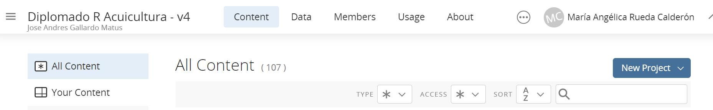

<style>
#TOC {
  color: black;
  font-familiy: Calibri;
  font-size: 14px;
  border-color: #708090; 
}
body {
   color: black;
   font-familiy: Calibri;
}

pre {
  color: black;
  background-color: #F8F8FF;
}
# header {
  color: #800000;
  font-familiy: Calibri;
  background-color: #F5F5F5;
  opacity: 0.8;
  font-size: 16px;
}
</style>


### **Objetivos de aprendizaje**

Los objetivos de aprendizaje de esta guía son:

**1**. Generar un proyecto en Rstudio Cloud.

**2**. Usar IA desde la interface de Rstudio Cloud.

### **Pasos:**

### **Paso 1.** Generar cuenta y clave en Platform. https://platform.openai.com/ 

### **Paso 2.** Generar la API Key. https://platform.openai.com/account/api-keys 

### **Paso 3.** Guardar la API KEY en un block de notas.

### **Paso 4.** Ir a RStudio Cloud y generar un proyecto personal.

En este paso debes generar un proyecto personal dandole click al botón **New Project** y coloquele a ese proyecto Clase_08_IA


```{r, echo=FALSE, out.width = '100%', fig.align='center'}

```

### **Paso 5.** Instalar paquete.


```{r, eval=FALSE}

install.packages("devtools")

```


### **Paso 6.** Habilitar paquete.

```{r, eval=FALSE}

library(devtools)

```


### **Paso 7.** Instalar paquete gptstudio desde Github.

```{r, eval=FALSE}

devtools::install_github("MichelNivard/gptstudio")

```


### **Paso 8.** Vincular la Api key. https://platform.openai.com/account/api-keys

```{r, eval=FALSE}

Sys.setenv(OPENAI_API_KEY = "COLOCAR SU API KEY")

```

