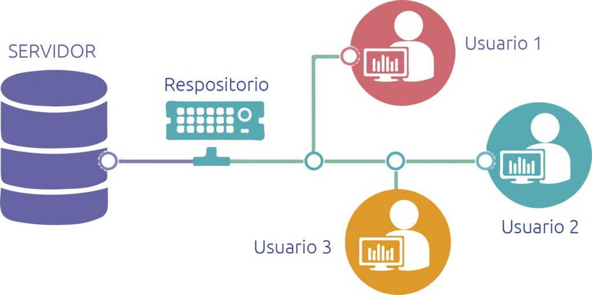
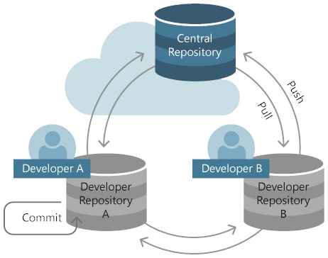

```{r setup, include=FALSE, comment=TRUE}
knitr::opts_chunk$set(echo = FALSE)
```

# PLAN DE CLASE

**1).** **Introducción**

- Control de versiones: ¿Por qué es importante?

- ¿Qué es Git?

- ¿Qué es Github?

- ¿Cómo funciona Github?

- Flujo de trabajo y comandos importantes.

**2).** **Práctica con R y Rstudio cloud**

- Crear un repositorio Github para el control de versiones.

- Familiarizarse con el control de versiones en Github.


# ¿QUÉ ES EL CONTROL DE VERSIONES?

- Es la práctica de rastrear y gestionar los cambios de un proyecto de desarrollo de software.

- Muy importante en ciencia moderna de datos e investigación reproducible.

```{r, echo=FALSE, out.width = '70%', fig.align='center'}

```

# VENTAJAS DEL CONTROL DE VERSIONES

Un buen control de versiones te permitirá:

- Administrar tu proyecto de análisis de datos (tesis) de manera profesional.  

- Dar trazabilidad total a los cambios, facilita el trabajo colaborativo. 

- Corregir errores y reducir el riesgo de perdida de datos.

```{r, echo=FALSE, out.width = '40%', fig.align='center'}

```

# ¿QUE ES GIT?

- [Git](http://git-scm.com/) es un software de control de versiones diseñado por Linus Torvalds (Creador del SO Linux).

- Software de código abierto.

- Miles de compañías (Google, Neflix, Andriod, etc.) lo usan de manera regular.

```{r, echo=FALSE, out.width = '60%', fig.align='center'}
knitr::include_graphics("Git_logo.png")
```

# **¿QUÉ ES GITHUB?**

- Principal plataforma de desarrollo colaborativo para alojar proyectos utilizando el sistema de control de versiones Git.

- 31 millones de usuarios.

- Gratuito a nivel nivel usuario.

- Desde 2018 pertenece a Microsoft (comprado por US$7.500 millones de dólares).

```{r, echo=FALSE, out.width = '60%', fig.align='center'}
knitr::include_graphics("Github_logo.png")
```

# CÓMO FUNCIONA: NIVEL USUARIO.

- Permite crear y administar tus proyectos (repositorios).  
- Permite difundir y comunicar tu trabajo.  

```{r, echo=FALSE, out.width = '80%', fig.align='center'}

```

# CÓMO FUNCIONA: ORGANIZACIONES.

- Permite administrar grupos de trabajo o proyectos.

```{r, echo=FALSE, out.width = '80%', fig.align='center'}

```

[Fuente: Startyourlab](ttps://www.startyourlab.com/docs/github-organizations/)

# CÓMO FUNCIONA: REPOSITORIOS.

- Permite administrar un proyecto de análisis de datos.
 
- Pueden ser públicos o privados.  

```{r, echo=FALSE, out.width = '80%', fig.align='center'}

```

# FLUJO DE TRABAJO: INICIO.

1. Instalar git y entorno de desarrollo de tu preferencia: [Github](https://github.com/), [Bitbucket](https://bitbucket.org/), [Gitlab](https://about.gitlab.com/).

- Nosotros usaremos Github en la nube.

2. Crear cuenta de usuario y repositorio.

    *git init* 
  
    
3. Clonar y configurar Proyecto en Posit cloud.

    *git clone https://github.com/Alumno/Diplomado.git*
    
    *git config --global user.name "Nombre alumno"*
    
    *git config --global user.email "alumno@mail.com"*
  
    
# FLUJO DE TRABAJO: README.

- Crear archivo de texto en formato markdown **.md**.   
  
    *git add readme.md*
  
- Contiene descripción básica de un proyecto/repositorio.  

```{r, echo=FALSE, out.width = '70%', fig.align='center'}

```


# FLUJO DE TRABAJO: COMMIT, PULL, PUSH.

```{r, echo=FALSE, out.width = '70%', fig.align='center'}

```

[Fuente: Microsoft](https://docs.microsoft.com/en-us/devops/develop/git/set-up-a-git-repository)

# RESUMEN DE COMANDOS IMPORTANTES

- **git config**: Configuración de un repositorio de Git para la colaboración remota. \
&nbsp;  
- **git init**: Inicia control de versiones de un directorio.\
&nbsp;  
- **git clone**: Clona un repositorio local o remoto.\
&nbsp;  
- **git commit**: Captura una versión de los cambios de un repositorio y le asigna un índice. \
&nbsp;  
- **git push**: Envía cambios a un repositorio.\
&nbsp;  
- **git pull**: Trae cambios desde un repositorio a un computador.


# RESUMEN DE LA CLASE

- Porque es importante un Control de versiones.\
&nbsp;  

- Conocemos Git y Github.\
&nbsp;  

- Creamos repositorio Github para el control de versiones.\
&nbsp;  

- Nos familiarizamos con flujo de trabajo y comandos importantes.


