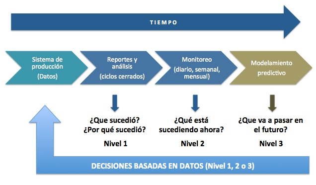
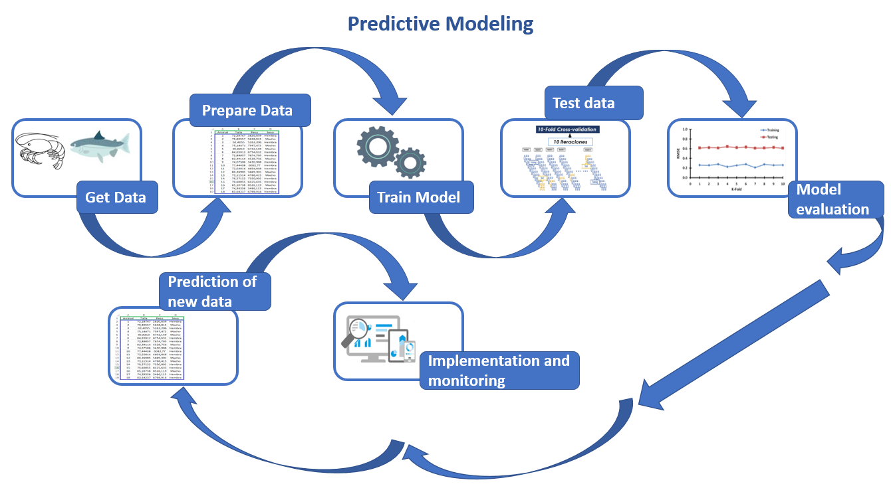
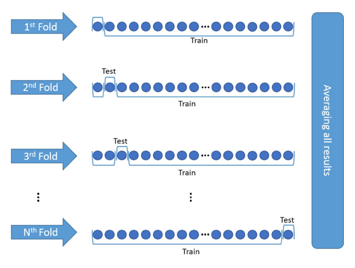
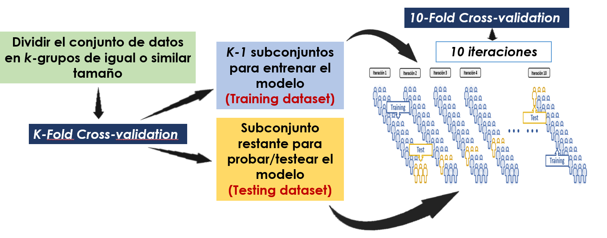
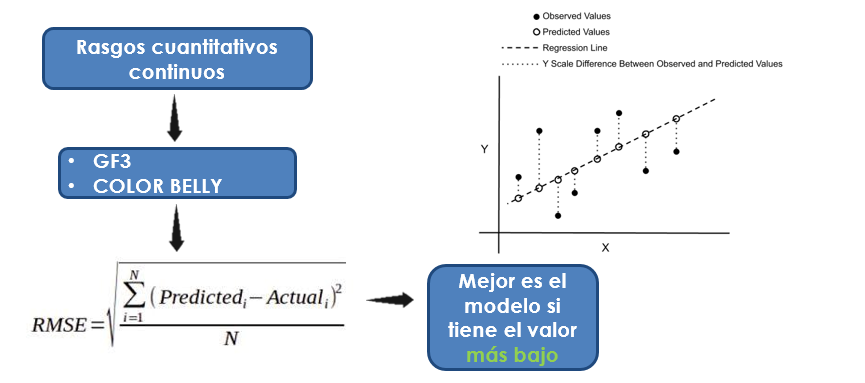
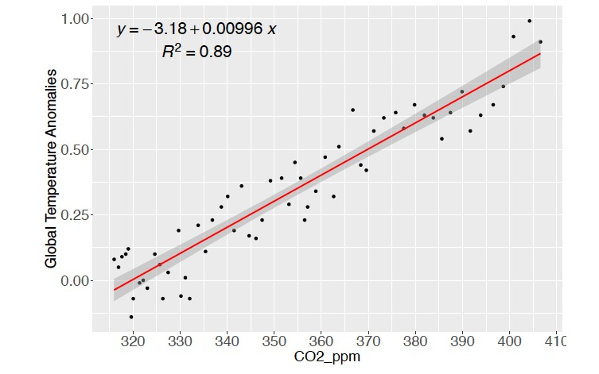
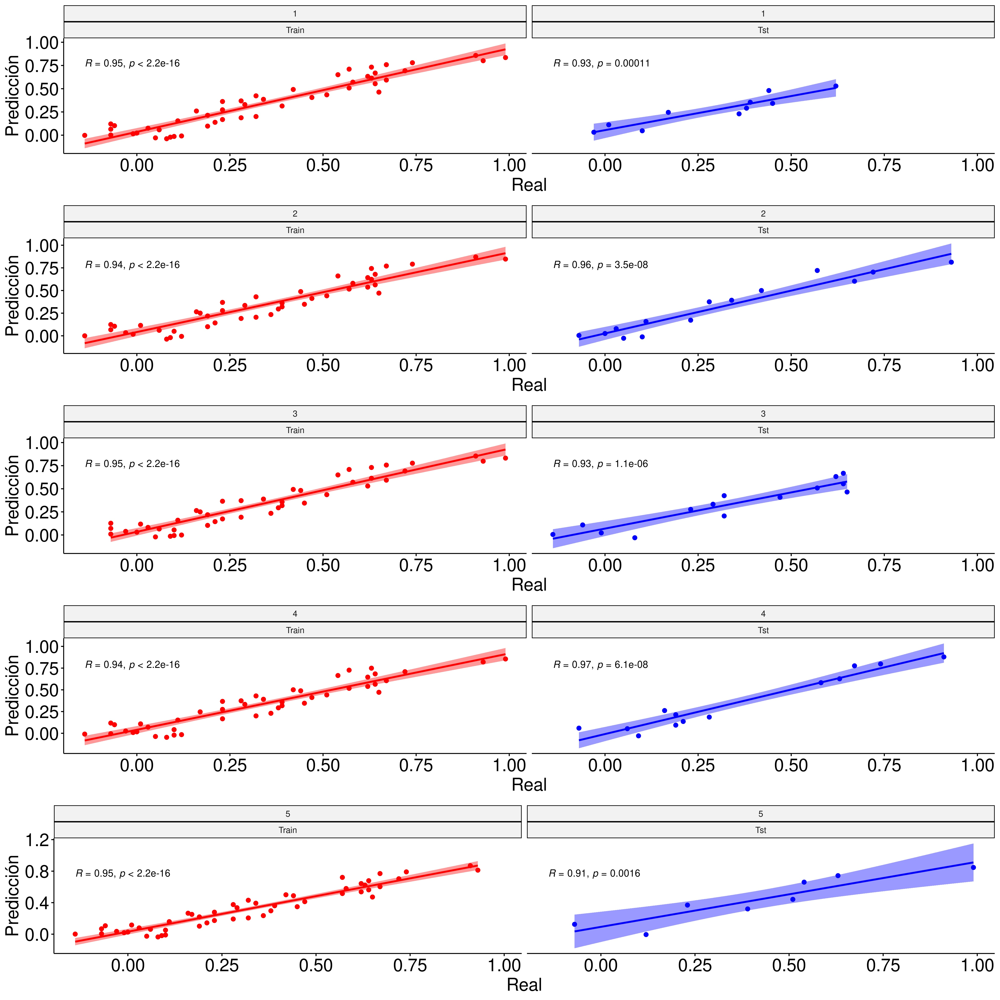
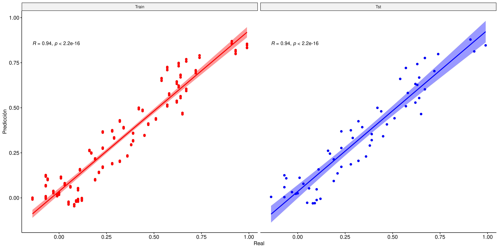
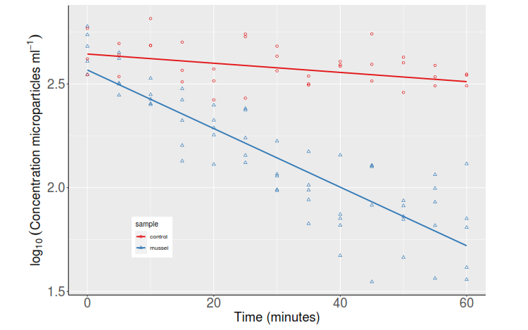

```{r setup, include=FALSE}
knitr::opts_chunk$set(echo = FALSE)
library(caret)
library(readxl)
library(ggplot2)
library(car)
library(lmtest)
library(pander)
library(dplyr)
library(ggpmisc)
library(gridExtra)
library(ggpubr)
library(knitr)
```

# **PLAN DE LA CLASE**

**1.- Introducción**

- ¿Qué es el modelamiento predictivo?
- Tipos de modelos predictivos.
- Etapas del modelamiento predictivo.
- Partición del conjunto de datos:entrenamiento y testeo.
- Métodos de validación.
- ¿Cómo medir la precisión/desempeño del modelo?

**2.- Práctica con R y Rstudio cloud.** 

- Realizar modelamiento predictivo para regresión lineal.  
- Realizar gráficas avanzadas con ggplot2.  


# **¿QUÉ ES EL MODELAMIENTO PREDICTIVO?**

El modelamiento predictivo es una técnica utilizada en el campo del análisis de datos y la inteligencia artificial para predecir eventos futuros o hacer estimaciones basadas en datos históricos.


```{r, echo=FALSE, out.width = '100%',fig.align='center'}

```

# **MACHINE LEARNING Y MODELOS PREDICTIVOS**

Existen diferentes modelos predictivos, los cuales se clasifican bajo el marco del aprendizaje automático, machine learning en ingés, como algoritmos o metodos supervizados y no supervizados.


```{r, echo=FALSE, out.width = '95%',fig.align='center'}
knitr::include_graphics("Machine_learning_fig.png")
```

# **ETAPAS DEL MODELAMIENTO PREDICTIVO**

```{r, echo=FALSE, out.width = '100%',fig.align='center'}

```

# **PARTICIÓN DEL CONJUNTO DE DATOS**

El **training dataset** y el **testing dataset** son dos conjuntos de datos utilizados en el aprendizaje automático y la minería de datos para entrenar y evaluar modelos predictivos. 

| **Conjunto de entrenamiento**                                                                                                       | **Conjunto de prueba/testeo**                                                                                            |
|-------------------------------------------------------------------------------------------------------------------------------------|--------------------------------------------------------------------------------------------------------------------------|
| - Conjunto de datos utilizado para entrenar un modelo predictivo.                                                                   | - Conjunto de datos utilizado para evaluar el desempeño y la capacidad de generalización de un modelo entrenado.         |
| - Contiene variables predictoras y variable a predecir.                                                                             | - No se utiliza para entrenar el modelo.                                                                                 |
| - El modelo utiliza este conjunto de datos para aprender patrones y relaciones entre las variables predictoras y variable repuesta. | - Los resultados obtenidos en el testing dataset ayudan a estimar el desempeño del modelo en situaciones del mundo real. |

# **¿PORQUÉ VALIDAR UN MODELO PREDICTIVO?**

- Saber qué tan bien funciona: La validación nos dice qué tan preciso es nuestro modelo en la predicción de nuevos datos.

- Evitar errores de sobreajuste: Validar nos ayuda a evitar el error común de ajustar demasiado nuestro modelo a los datos de entrenamiento, lo cual puede llevar a predicciones poco confiables.

- Comparar modelos: Podemos validar varios modelos y comparar su desempeño, para elegir el mejor en función de las métricas de evaluación.

- Optimizar hiperparámetros: La validación nos permite ajustar los hiperparámetros del modelo para mejorar su rendimiento y precisión.

# **ALGUNOS TIPOS DE VALIDACIÓN**

- **Validación cruzada Leave-One-Out:** Proceso de dejar una observación fuera del conjunto de entrenamiento y utilizarla como conjunto de prueba, mientras que el resto de las observaciones se utilizan para entrenar el modelo.

- **Validación cruzada K-fold:** Consiste en dividir el conjunto de datos en K grupos o "pliegues" de aproximadamente igual tamaño. Se selecciona uno de los pliegues como conjunto de prueba y los K-1 pliegues restantes como conjunto de entrenamiento.

# **VALIDACIÓN CRUZADA LEAVE-ONE-OUT**

```{r, echo=FALSE, out.width = '90%' }

```

# **VALIDACIÓN CRUZADA K-FOLD**

```{r, echo=FALSE, out.width = '110%' }

```

# **¿CÓMO MEDIR EL DESEMPEÑO DEL MODELO?**

**Métricas de evaluación**

```{r, echo=FALSE, out.width = '100%', fig.align='center'}

```

# **ESTUDIO DE CASO: REGRESIÓN LINEAL SIMPLE**

Queremos predecir las anomalías de la temperatura global en función del CO2.

```{r, echo=FALSE, out.width = '100%', fig.align='center'}

```

```{r, message=FALSE, out.width = '80%', fig.align='center'}
# Importa base de datos
Global_warming <- read_excel("Global_Warming.xlsx")

# Formato formula para considerar en el grafico
formula1 <- y ~ x

# Transforma la variable Year a factor
Global_warming$Year <- as.factor(Global_warming$Year)

# Transforma la variable CO2_ppm a númerica
Global_warming$CO2_ppm <- as.numeric(Global_warming$CO2_ppm)

# Transforma la variable Global Temperature Anomalies a númerica
Global_warming$`Global Temperature Anomalies` <- as.numeric(Global_warming$`Global Temperature Anomalies`)
```

# **VALIDACIÓN CRUZADA K-FOLD (K=5)**
```{r, message=FALSE, out.width = '70%', fig.align='center'}
# Validación k-fold (k=5)
# Establecer la semilla aleatoria para reproducibilidad
set.seed(12345)

# Crear los índices para la validación cruzada
folds <- sample(1:5, size = nrow(Global_warming), replace = TRUE)

# Crear un data frame vacío
results_df <- data.frame(True = numeric(), Predicted = numeric(), Fold = integer(), Data = character(), stringsAsFactors = FALSE)

# Bucle para agregar los valores True, Predicted, Fold y Data de cada fold al dataframe
for (i in 1:max(folds)) {
  tst <- which(folds == i)
  train <- which(folds != i)
  train_data <- Global_warming[train, ]
  test_data <- Global_warming[tst, ]
  
  # Ajustar el modelo de regresión lineal simple en el conjunto de entrenamiento
  reg <- lm(`Global Temperature Anomalies` ~ CO2_ppm, data = train_data)
  
  # Realizar predicciones en el conjunto de prueba
  predictions <- predict(reg, newdata = test_data)
  
  # Calcular el error de prueba (RMSE)
  rmse <- sqrt(mean((predictions - test_data$`Global Temperature Anomalies`)^2))
  
  # Calcular el error de prueba (MSE)
  mse <- mean((predictions - test_data$`Global Temperature Anomalies`)^2)
  
  # Agregar los valores True, Predicted, Fold y Data del conjunto de entrenamiento al data frame
  train_df <- data.frame(True = train_data$`Global Temperature Anomalies`, Predicted = predict(reg, newdata = train_data), Fold = i, Data = rep("Train", length(train)), stringsAsFactors = FALSE)
  results_df <- rbind(results_df, train_df)
  
  # Agregar los valores True, Predicted, Fold y Data del conjunto de prueba al data frame
  tst_df <- data.frame(True = test_data$`Global Temperature Anomalies`, Predicted = predictions, Fold = i, Data = rep("Tst", length(tst)), stringsAsFactors = FALSE)
  results_df <- rbind(results_df, tst_df)
}


data_train <- results_df %>%
              filter(Data=="Train")%>%
               slice(1:5)

data_test <- results_df %>%
              filter(Data=="Tst")%>%
              slice(1:5)

combined_data <- bind_rows(data_train, data_test)

kable(head(combined_data, 10), digits = 2)

```

# **VALIDACIÓN CRUZADA K-FOLD (K=5)**

```{r, message=FALSE, out.width = '70%', fig.align='center'}
# Validación k-fold (k=5)
# Establecer la semilla aleatoria para reproducibilidad
set.seed(12345)

# Crear los índices para la validación cruzada
folds <- sample(1:5, size = nrow(Global_warming), replace = TRUE)

# Crear un data frame vacío
results_df <- data.frame(True = numeric(), Predicted = numeric(), Fold = integer(), Data = character(), stringsAsFactors = FALSE)

# Bucle para agregar los valores True, Predicted, Fold y Data de cada fold al dataframe
for (i in 1:max(folds)) {
  tst <- which(folds == i)
  train <- which(folds != i)
  train_data <- Global_warming[train, ]
  test_data <- Global_warming[tst, ]
  
  # Ajustar el modelo de regresión lineal simple en el conjunto de entrenamiento
  reg <- lm(`Global Temperature Anomalies` ~ CO2_ppm, data = train_data)
  
  # Realizar predicciones en el conjunto de prueba
  predictions <- predict(reg, newdata = test_data)
  
  # Calcular el error de prueba (RMSE)
  rmse <- sqrt(mean((predictions - test_data$`Global Temperature Anomalies`)^2))
  
  # Calcular el error de prueba (MSE)
  mse <- mean((predictions - test_data$`Global Temperature Anomalies`)^2)
  
  # Agregar los valores True, Predicted, Fold y Data del conjunto de entrenamiento al data frame
  train_df <- data.frame(True = train_data$`Global Temperature Anomalies`, Predicted = predict(reg, newdata = train_data), Fold = i, Data = rep("Train", length(train)), stringsAsFactors = FALSE)
  results_df <- rbind(results_df, train_df)
  
  # Agregar los valores True, Predicted, Fold y Data del conjunto de prueba al data frame
  tst_df <- data.frame(True = test_data$`Global Temperature Anomalies`, Predicted = predictions, Fold = i, Data = rep("Tst", length(tst)), stringsAsFactors = FALSE)
  results_df <- rbind(results_df, tst_df)
}

# Agrupar los datos por Fold y calcular el R2 para cada grupo
R_R2_RMSE_by_fold <- results_df %>%
  group_by(Fold, Data) %>%
  summarize(R = cor(True, Predicted),
            R2 = summary(lm(True ~ Predicted))$r.squared, 
            MSE= mean((True - Predicted)^2),
            RMSE = sqrt(mean((True - Predicted)^2)),
            n=n())

# Mostrar los resultados
kable(head(R_R2_RMSE_by_fold,10), digits = 2)
```


# **VALIDACIÓN 5-FOLD**

```{r, echo=FALSE, out.width = '70%',fig.align='center'}

```

# **VALIDACIÓN 5-FOLD** 

```{r, out.width = '100%',fig.align='center'}

```

```{r, message=FALSE, out.width = '70%', fig.align='center'}
# Calcular el promedio de los errores de prueba (MSE promedio)
MSE_average <- R_R2_RMSE_by_fold%>%
               group_by(Data)%>%
               summarise(MSE_PROMEDIO=mean(MSE))

# Calcular el promedio de los errores de prueba (RMSE promedio)
RMSE_average <- R_R2_RMSE_by_fold%>%
                group_by(Data)%>%
                summarise(RMSE_PROMEDIO=mean(RMSE))

datos_all <- left_join(MSE_average,RMSE_average, by="Data")
datos_all
```


# **ESTUDIO DE CASO: REGRESIÓN LINEAL MÚLTIPLE**

```{r, out.width = '100%',fig.align='center'}

```

```{r, message=FALSE, out.width = '100%', fig.align='center'}
clearance <-  read_excel("ParticleClearance.xlsx", sheet = 1)

clearance <- clearance%>%
            select(time,sample, microparticle_concentration,log_microparticle_concentration)

```


# **VALIDACIÓN LEAVE-ONE-OUT**

```{r, message=FALSE, out.width = '100%', fig.align='center'}
# Generar vector vacio para guardar los resultados de la validación leave-one-out
validation_results <- vector("numeric", length = nrow(clearance))

# Realizar la validación leave-one-out
for (i in 1:nrow(clearance)) {
  # Obtener el conjunto de entrenamiento
  train_data <- clearance[-i, ]
  
  # Obtener el conjunto de prueba
  test_data <- clearance[i, ]
  
  # Ajustar el modelo de regresión múltiple en el conjunto de entrenamiento
  lm_model <- lm(log_microparticle_concentration ~ time*sample + time + sample, data = train_data)
  
  # Realizar predicciones en el conjunto de prueba
  predictions <- predict(lm_model, newdata = test_data)
  
  # Calcular el error de prueba (RMSE)
  rmse <- sqrt(mean((test_data$log_microparticle_concentration - predictions)^2))
  
  # Guardar el error en el vector de resultados
  validation_results[i] <- rmse
}

average_rmse <- round(mean(validation_results),2)

results_df <- data.frame(Fold = 1:nrow(clearance), RMSE = validation_results)

# Seleccionar las primeras 5 observaciones
first_5 <- head(results_df, 5)

# Seleccionar las últimas 5 observaciones
last_5 <- tail(results_df, 5)

# Combinar los resultados en un nuevo dataframe
new_df <- rbind(first_5, last_5)

kable(new_df, digits = 2)

average_rmse

```


# **VALIDACIÓN LEAVE-ONE-OUT**

```{r, message=FALSE, out.width = '100%', fig.align='center'}
ggplot(results_df, aes(x = Fold, y = RMSE)) +
  geom_line() +
  geom_point() +
  geom_hline(yintercept = average_rmse, linetype = "dashed", color = "red") +
  xlab("Fold") +
  ylab("RMSE") +
  ggtitle("Valores de RMSE en Validación Leave-One-Out") +
  theme_bw() +
  theme(plot.title = element_text(size = 16, face = "bold"),
        axis.title = element_text(size = 14),
        axis.text = element_text(size = 12))
  

```

# **PRÁCTICA ANÁLISIS DE DATOS**

- El trabajo práctico se realiza en Rstudio.cloud. 
- Guía de clase 16 en formato html.


# **RESUMEN DE LA CLASE**

- Modelamiento predictivo Supervisado y No supervisado.

- Partición del conjunto de datos: entrenamiento y testeo.

- Tipos de validación (leave-one-out, K-fold).

- Métricas de evaluación (MSE, RMSE).
