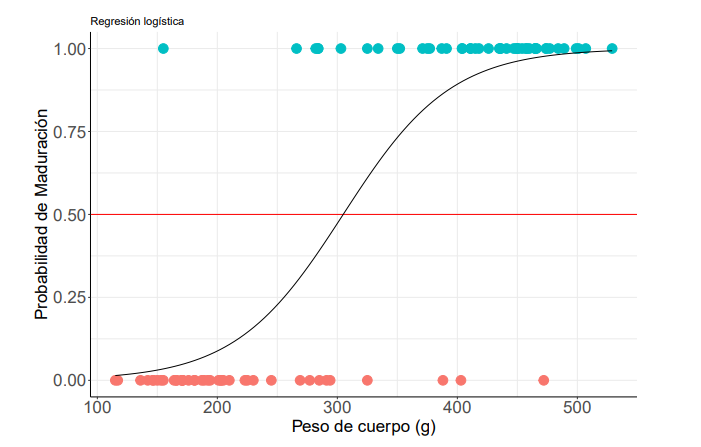

```{r setup, include=FALSE}
knitr::opts_chunk$set(echo = FALSE)
library(car)
library(lmtest)
library(psych)
library(readxl)
library(nlme)
library(lme4)
library(stats)
library(boot)
library(readxl)
library(dplyr)
library(ggplot2)
library(ggpmisc)
library(knitr)
library(gridExtra)
library(nortest)
library(reshape2)
library(pROC)
```

# **PLAN DE LA CLASE**

**1.- Introducción**

- Tipos de modelos predictivos.

- Regresión logística.

- Validación split-sample.

- ¿Cómo medir la precisión/desempeño del modelo?

**2.- Práctica con R y Rstudio cloud.** 

- Realizar modelamiento predictivo para regresión logística.  
- Realizar gráficas avanzadas con ggplot2. 


# **MACHINE LEARNING Y MODELOS PREDICTIVOS**

Existen diferentes modelos predictivos, los cuales se clasifican bajo el marco del aprendizaje automático, machine learning en inglés, como algoritmos o metodos supervisados y no supervisados.


```{r, echo=FALSE, out.width = '95%',fig.align='center'}
knitr::include_graphics("Machine_learning_fig.png")
```


# **REGRESIÓN LOGÍSTICA**

```{r, echo=FALSE, out.width = '95%',fig.align='center'}

```


# **VALIDACIÓN SPLIT-SAMPLE**

- División de datos: 70-80% de los datos para el conjunto de entrenamiento y el 30-20% restante para el conjunto de prueba. 

- Evaluación del desempeño del modelo predictivo: Se usan métricas como la precisión, el área bajo la curva (AUC), la sensibilidad, la especificidad, entre otras.

- Variabilidad de los resultados: Es recomendable realizar múltiples particiones y promediar los resultados para obtener una evaluación más confiable del rendimiento del modelo.

- Sobreajustar y subajustar: Detectar problemas de sobreajuste (overfitting) y subajuste (underfitting) del modelo.

# **VALIDACIÓN CRUZADA SPLIT-SAMPLE**

```{r, echo=FALSE, out.width = '110%' }

```

# **¿CÓMO MEDIR EL DESEMPEÑO DEL MODELO?**

**Métricas de evaluación**

```{r, echo=FALSE, out.width = '100%', fig.align='center'}

```


# **ESTUDIO DE CASO: REGRESIÓN LOGÍSTICA EN CAMARONES**

Y: Estado del Camaron: (0) fresco o en mal estado: (1). 

X: Nitrógeno Volátil Total (Método destructivo).


```{r, echo=FALSE, out.width = '90%', fig.align='center'}
knitr::include_graphics("paper_camaron.jpeg")
```


# **CALIDAD DE CAMARÓN**


```{r, echo=FALSE, out.width = '80%', fig.align='center'}

```


# **ÁREA BAJO LA CURVA**


```{r, echo=FALSE, out.width = '90%', fig.align='center'}

```


# **ESTUDIO DE CASO: REGRESIÓN LOGÍSTICA SIMPLE**

Queremos predecir la probabilidad de madurar en función del peso.

```{r, echo=FALSE, out.width = '100%', fig.align='center'}

```

```{r, message=FALSE, out.width = '80%', fig.align='center'}
maduracion <- read_excel("Maturation.xlsx")

maduracion$Genotype <- as.factor(maduracion$Genotype)

maduracion <- maduracion%>% 
              select("Fish","Genotype","Gonad","Mass","Maturation")

```

# **VALIDACIÓN SPLIT-SAMPLE**

```{r, message=FALSE, out.width = '70%', fig.align='center'}

# División del conjunto de datos en entrenamiento y prueba
set.seed(123)  # Para reproducibilidad
indice_entrenamiento <- sample(nrow(maduracion), floor(0.7 * nrow(maduracion)))
datos_entrenamiento <- maduracion[indice_entrenamiento, ]
datos_prueba <- maduracion[-indice_entrenamiento, ]

# Ajuste del modelo de regresión logística en los datos de entrenamiento
mod_logit <- glm(Maturation ~ Mass, family = binomial, data = datos_entrenamiento)

# Predicción en los datos de prueba
predicciones <- predict(mod_logit, newdata = datos_prueba, type = "response")

# Conversión de las probabilidades en clases predichas
clases_predichas <- ifelse(predicciones > 0.5, 1, 0)

# Evaluación del modelo
matriz_confusion <- table(clases_predichas, datos_prueba$Maturation)

# Predicciones en los datos de prueba
datos_prueba$Probabilidad <- predict(mod_logit, newdata = datos_prueba, type = "response")

# Mostrar los resultados
kable(head(datos_prueba,10), digits = 2)

```


# **PREDICCIONES DE LA REGRESIÓN LOGÍSTICA SIMPLE**

**n: 88 datos   train_data: 61 y test_data: 27**

```{r, message=FALSE, out.width = '70%', fig.align='center', echo=FALSE, warning=FALSE, error=FALSE, message=FALSE}
# Predicciones en los datos de prueba
datos_prueba$Probabilidad <- predict(mod_logit, newdata = datos_prueba, type = "response")

# Generar objeto My_Theme para personalizar el gráfico 
My_Theme = theme(
  axis.title.x = element_text(size = 20),
  axis.text.x = element_text(size = 20),
  axis.title.y = element_text(size = 20),
  axis.text.y = element_text(size = 20))


# Crear un gráfico de dispersión con puntos coloreados según la probabilidad
ggplot(datos_prueba, aes(x = Mass, y = Maturation, color = Probabilidad)) +
  geom_point() +
  stat_function(fun = function(x){predict(mod_logit,
                                          newdata = data.frame(Mass = x),
                                          type = "response")})+
  scale_color_gradient(low = "blue", high = "red") +
  labs(x = "Peso de cuerpo", y = "Probabilidad de Maduración", color = "Probabilidad") +
  theme_minimal()+ My_Theme


```

# **MATRIZ DE CONFUSIÓN Y MÉTRICAS DE EVALUACIÓN**

```{r, echo=FALSE, out.width = '100%', fig.align='center'}

```


# **AREA BAJO LA CURVA ROC (AUC)**

```{r, message=FALSE, out.width = '70%', fig.align='center', echo=FALSE, warning=FALSE, error=FALSE, message=FALSE}

# Crear objeto de curva ROC
roc_obj <- roc(datos_prueba$Maturation, datos_prueba$Probabilidad)

# Obtener datos de sensibilidad y especificidad
roc_data <- coords(roc_obj, "all")

# Calcular el área bajo la curva ROC
auc <- auc(roc_obj)

# Crear gráfico de la curva ROC
ggplot(roc_data, aes(x = 1 - specificity, y = sensitivity)) +
  geom_path(color = "darkblue", size = 1.5) +
  geom_abline(intercept = 0, slope = 1, linetype = "dashed", color = "red") +
  labs(x = "Tasa de Falsos Positivos (1 - Especificidad)",
       y = "Tasa de Verdaderos Positivos (Sensibilidad)",
       title = "Curva ROC",
       subtitle = paste("AUC =", round(auc, 2))) +
  theme_minimal() +
  theme(plot.title = element_text(size = 16, face = "bold"),
        plot.subtitle = element_text(size = 14),
        axis.title = element_text(size = 12),
        axis.text = element_text(size = 10),
        legend.position = "none")+My_Theme

```


# **PRÁCTICA ANÁLISIS DE DATOS**

- El trabajo práctico se realiza en Rstudio.cloud. 


# **RESUMEN DE LA CLASE**

- Validación (Split-Sample).

- Métricas de evaluación (AUC, Especificidad, Precisión, Sensibilidad, Exactitud).
