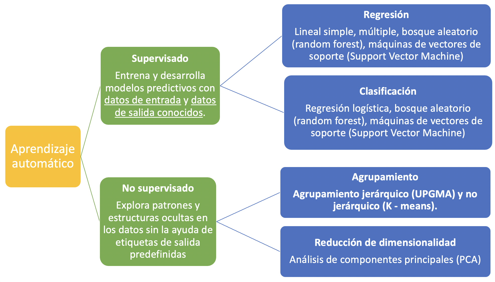
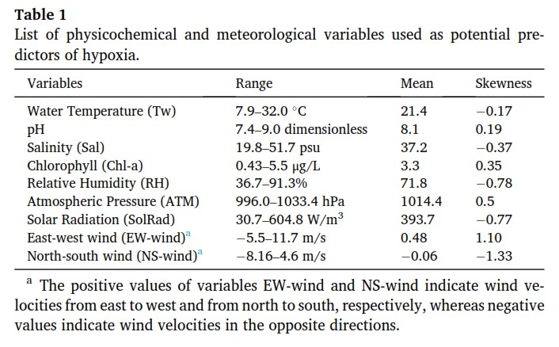
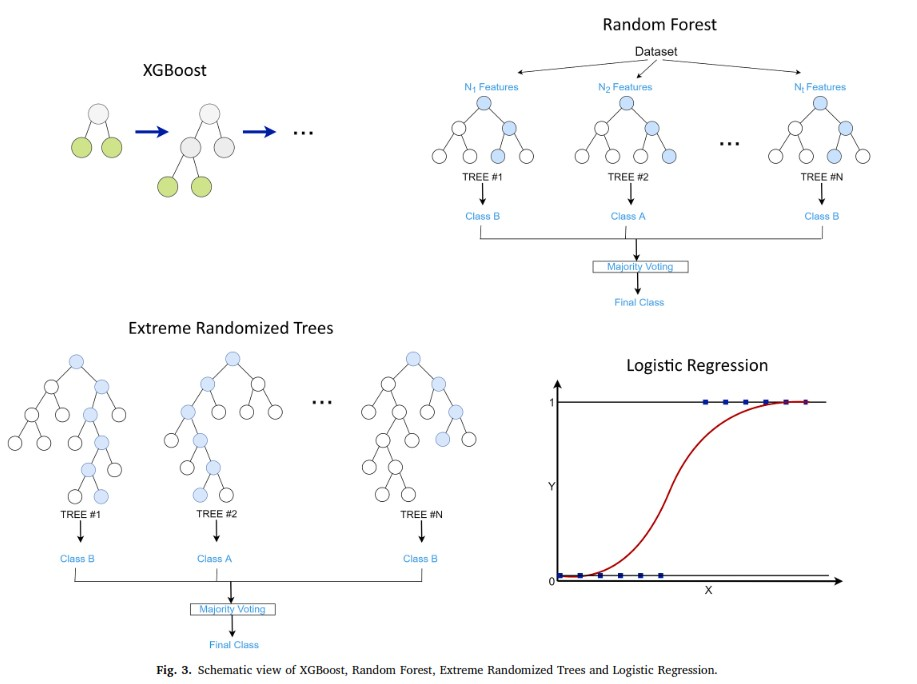
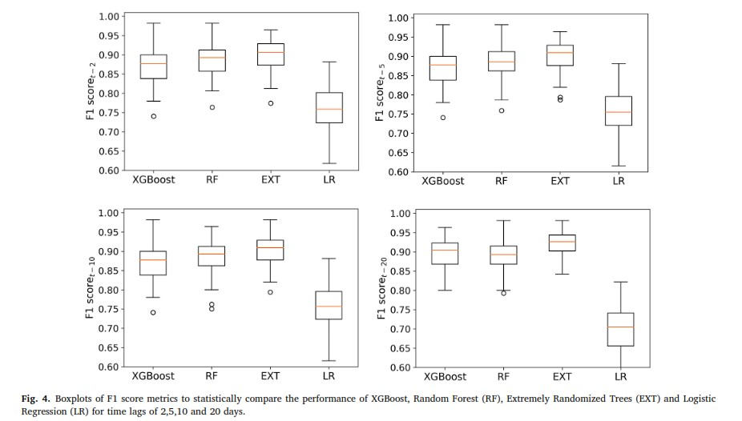
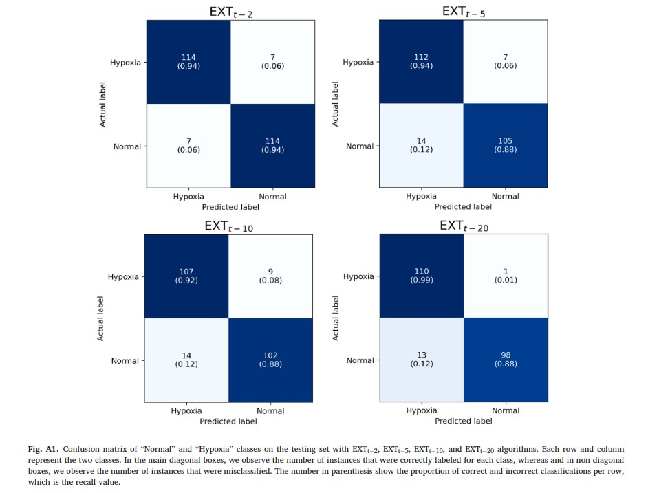
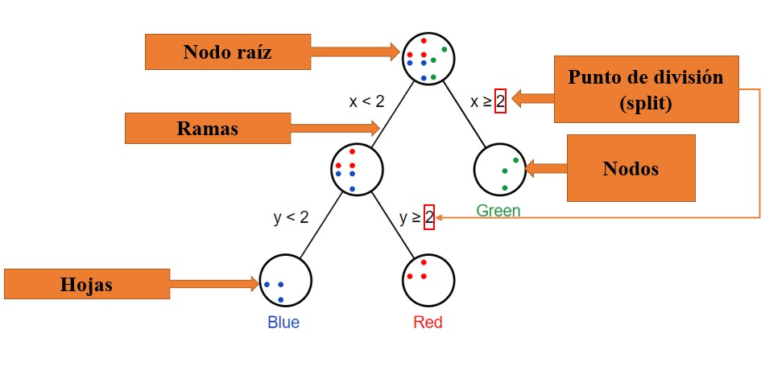
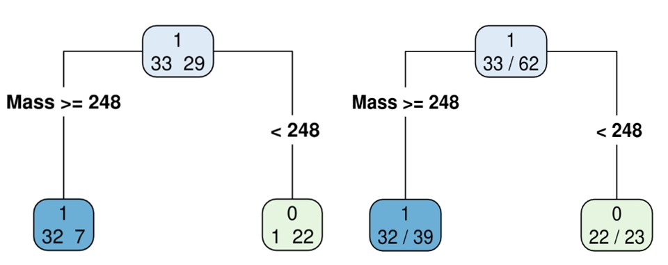
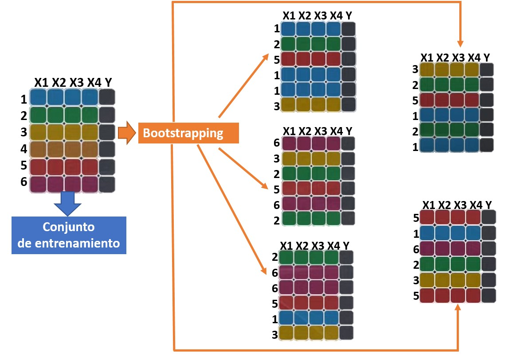
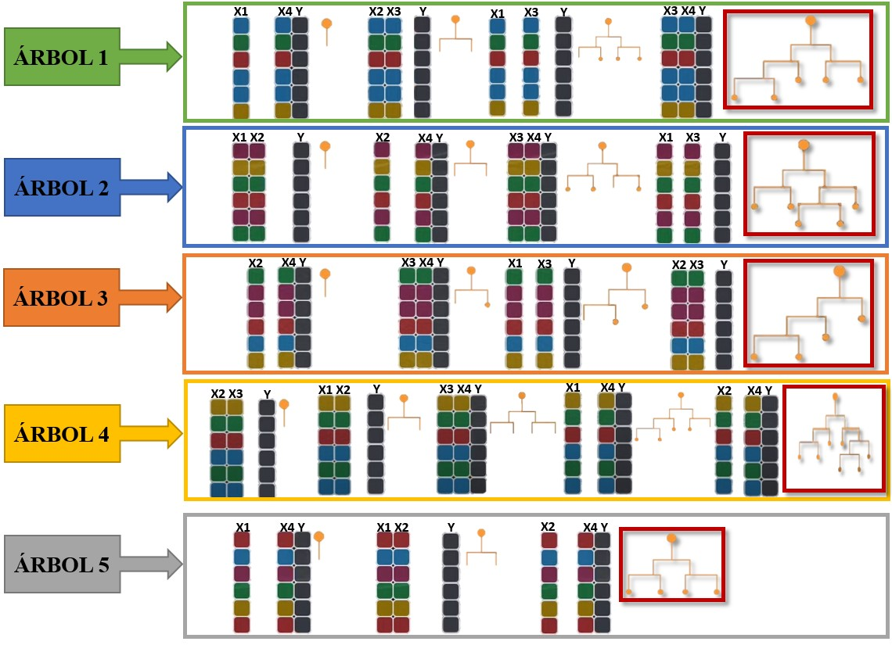

```{r setup, include=FALSE}
knitr::opts_chunk$set(echo = FALSE)
library(car)
library(lmtest)
library(psych)
library(readxl)
library(nlme)
library(lme4)
library(stats)
library(boot)
library(readxl)
library(dplyr)
library(ggplot2)
library(ggpmisc)
library(knitr)
library(gridExtra)
library(nortest)
library(reshape2)
library(pROC)
library(randomForest)
library(e1071)
library(ggplot2)
library(caret)
library(gridExtra)
library(kernlab)
library(plotly)
library(rpart.plot)
library(rpart)
library(pander)
library(kableExtra)
```

# **PLAN DE LA CLASE**

**1.- Introducción**

- Tipos de modelos predictivos.

- ¿Qué son los arboles de decisión?

- ¿Qué es el algoritmo de Random Forest?

- Métricas para medir el desempeño de un modelo de clasificación.

- Práctica con ejemplo de maduración temprana.

**2.- Práctica con R y Rstudio cloud.** 

- Realizar modelamiento predictivo con Árboles de Decisión y Random Forest. 
- Realizar gráficas avanzadas con ggplot.


# **MACHINE LEARNING Y MODELOS PREDICTIVOS**

Existen diferentes modelos predictivos, los cuales se clasifican bajo el marco del aprendizaje automático, machine learning en inglés, como algoritmos o metodos supervisados y no supervisados.


```{r, echo=FALSE, out.width = '95%',fig.align='center'}

```


# **ESTUDIO DE CASO: PREDICCIÓN DE HIPOXIA EN LAGUNA**

```{r, echo=FALSE, out.width = '80%',fig.align='center'}

```

[Fuente: Politikos et al. 2021](https://doi.org/10.1016/j.ecoinf.2021.101480)

# **MÉTODOS DE PREDICCIÓN**

```{r, echo=FALSE, out.width = '80%',fig.align='center'}

```


# **PERFORMANCE DE LOS MODELOS**

**F1-Score** : Es una métrica que sirve para medir el desempeño del modelo de clasificación. Un valor alto indica (Buen desempeño del modelo predictivo).

```{r, echo=FALSE, out.width = '100%',fig.align='center'}

```      

[Fuente: Politikos et al. 2021](https://doi.org/10.1016/j.ecoinf.2021.101480)

# **MATRIZ DE CONFUSIÓN**

```{r, echo=FALSE, out.width = '80%',fig.align='center'}

```

[Fuente: Politikos et al. 2021](https://doi.org/10.1016/j.ecoinf.2021.101480)


# **¿QUÉ SON LOS ÁRBOLES DE DECISIÓN?**

- Los árboles de decisión son un tipo de modelo de aprendizaje automático supervisado.

- Son estructuras de tipo árbol que representan un conjunto de reglas de decisión y predicción.

- Pueden manejar problemas de clasificación y regresión.

- Los arboles de decisión son la base de muchos modelos predictivos incluyendo Random forest.

# **PARTES DEL ÁRBOL DE DECISIÓN**

- **Nodo raíz:** Es el punto de partida del árbol y no tiene padres. Representa la característica o variable predictora que mejor separa los datos en función de la variable objetivo (**Var. Respuesta**).

- **Ramas:** Son las conexiones que salen del nodo raíz o de otros nodos y representan las diferentes opciones o caminos que se pueden tomar en función de los valores de una variable predictora.

- **Hojas:** Son los **_nodos terminales_** del árbol y no tienen hijos. Representan las decisiones finales o las clasificaciones de las instancias de datos.

- **Punto de división:** Es el criterio utilizado para dividir los datos en dos ramas durante la construcción del árbol. 


# **PARTES DEL ÁRBOL DE DECISIÓN**

```{r, echo=FALSE, out.width = '100%',out.height='80%'}

```


# **ÍNDICE DE GINI**

- Cuando se construye un árbol de decisión, el algoritmo de Gini busca dividir los datos en cada nodo de la manera que minimice la impureza total de las ramas resultantes.

- El índice de Gini se utiliza para medir qué tan mezcladas están las clases en un nodo específico y se calcula considerando la probabilidad de selección aleatoria de una muestra y clasificarla incorrectamente. 

- Cuanto más bajo sea el valor del índice de Gini, más puro será el nodo y mejor será la separación de las clases en ese nodo.


# **EJERCICIO: ÁRBOL DE DECISIÓN MADURACIÓN TEMPRANA**

```{r, message=FALSE, out.width = '80%', fig.align='center'}
```


```{r, message=FALSE, out.width = '80%', fig.align='center'}
datos <- read_excel("Maturation.xlsx")

# Generar objeto My_Theme para personalizar el gráfico 
My_Theme <- theme(axis.title.x = element_text(size = 20, face = "bold"),
  axis.text.x = element_text(size = 20,face = "bold"),
  axis.title.y = element_text(size = 20, face = "bold"),
  axis.text.y = element_text(size = 20,face = "bold"))


datos$Maturation <- as.factor(datos$Maturation)
datos$Maturation <- relevel(datos$Maturation, ref = "1")
```


```{r, message=FALSE, out.width = '80%', fig.align='center'}
datos_1 <- datos%>% 
  select("Mass","SGR", "Length","GSI","Maturation")

# Realiza partición de los datos en conjuntos de entrenamiento y prueba
set.seed(123)
train_indices <- createDataPartition(datos_1$Maturation, p = 0.7, list = FALSE)
train_data <- datos_1[train_indices, ]
test_data <- datos_1[-train_indices, ] 

# Crear el gráfico de dispersión con etiquetas invertidas
ggplot(datos_1, aes(x = Mass, y = reorder(Maturation, desc(Maturation)))) +
  geom_point(aes(color = factor(Maturation)),size=3) +
  scale_y_discrete(breaks = c(1, 0), labels = c("Si Madura", "No Madura")) +
  scale_color_manual(values = c("coral", "darkblue"),
                     labels = c("Si Madura", "No Madura")) +
  labs(x = "Peso Cuerpo", y = "Estado de Maduración") +
  theme_classic() +
  theme(legend.position = "none")+My_Theme+
   scale_x_continuous(breaks = seq(100, 600, 50))

```

# **IDENTIFICAR PARTICIÓN EN ÁRBOL DE DECISIÓN**

```{r, message=FALSE, out.width = '70%', fig.align='center'}

# Entrenar el modelo de árbol de decisión
modelo_arbol <- rpart(Maturation ~ Mass, data = train_data,parms = list(split = 'gini'))

# Extraer indice de impureza Gini (Partición)
Splits <- modelo_arbol[["splits"]]

# Realizar predicciones en los datos de prueba
predicciones <- predict(modelo_arbol, newdata = test_data, type = "class")

test_data$predicciones <- predicciones


# Extraer indice de impureza Gini (Partición)
Splits <- modelo_arbol[["splits"]]
pander(Splits)

# Crear el gráfico de dispersión con el valor del split
ggplot(datos_1, aes(x = Mass, y = reorder(Maturation, desc(Maturation)))) +
  geom_point(aes(color = factor(Maturation)), size = 3) +
  geom_vline(xintercept = 248, linetype = "dashed", color = "red") +
  scale_y_discrete(breaks = c(1, 0), labels = c("Si Madura", "No Madura")) +
  scale_color_manual(values = c("coral", "darkblue"),
                     labels = c("Si Madura", "No Madura")) +
  labs(x = "Peso Cuerpo", y = "Estado de Maduración") +
  theme_classic() +
  theme(legend.position = "none") + My_Theme +
  scale_x_continuous(breaks = seq(100, 600, 50))

```


# **ÁRBOL DE DECISIÓN (CLASIFICACIÓN)**

train_data: 62 (**70%**)  Maduros:33  Inmaduros:29

```{r, echo=FALSE, out.width = '100%',fig.align='center'}

```


# **MATRIZ DE CONFUSIÓN**

## Función para hacer matriz de confusión `confusionMatrix()`

```{r, message=FALSE, out.width = '50%', fig.align='center'}

test_data$predicciones <- predicciones

# Crear la matriz de confusión
matriz_confusion <- confusionMatrix(predicciones, test_data$Maturation)

# Obtener la matriz de confusión con las etiquetas modificadas
matriz_confusion_modificada <- matriz_confusion[["table"]]
rownames(matriz_confusion_modificada) <- c("Maduro","Inmaduro")
colnames(matriz_confusion_modificada) <- c("Maduro","Inmaduro")

pander(matriz_confusion_modificada, caption = "Matriz de Confusión",
        split.cells = 20, style = "grid")

ACC<- round(matriz_confusion$overall['Accuracy'],2)


SEN <- round(matriz_confusion$byClass['Sensitivity'],2)


SPE <- round(matriz_confusion$byClass['Specificity'],2)

```


$ACC = \frac{(14+10)}{(14+0+2+10)}= 0.92$

$SEN = \frac{(14)}{(14+0)}= 1$

$SPE = \frac{(10)}{(10+2)}= 0.83$


# **AREA BAJO LA CURVA ROC (AUC)**

```{r, message=FALSE, out.width = '70%', fig.align='center', echo=FALSE, warning=FALSE, error=FALSE, message=FALSE}


# Realizar predicciones en los datos de prueba
predicciones <- predict(modelo_arbol, newdata = test_data, type = "class")

test_data$predicciones <- predicciones
# Crear objeto de curva ROC
roc_obj_D <- roc(as.numeric(test_data$Maturation), as.numeric(test_data$predicciones))

# Obtener datos de sensibilidad y especificidad
roc_data_D <- coords(roc_obj_D, "all")

# Calcular el área bajo la curva ROC
auc_D <- auc(roc_obj_D)

# Crear gráfico de la curva ROC
ggplot(roc_data_D, aes(x = 1 - specificity, y = sensitivity)) +
  geom_path(linetype = "solid", color = "darkblue", size = 1.5) +
  geom_abline(intercept = 0, slope = 1, linetype = "dashed", color = "red") +
  labs(x = "Tasa de Falsos Positivos (1 - Especificidad)",
       y = "Tasa de Verdaderos Positivos (Sensibilidad)",
       title = "Curva ROC",
       subtitle = paste("AUC =", round(auc_D, 2))) +
  theme_minimal() +
  theme(plot.title = element_text(size = 16, face = "bold"),
        plot.subtitle = element_text(size = 14),
        axis.title = element_text(size = 12),
        axis.text = element_text(size = 10),
        legend.position = "none")+My_Theme

```

# **EJERCICIO ÁRBOL DE DECISIÓN CON MÚLTIPLES VARIABLES**

n: 88, train_data: 62 (**70%**) y test_data: 26 (**30%**).

```{r, message=FALSE, out.width = '70%', fig.align='center'}

pander(head(datos_1,10), caption = "Tabla de datos",
        split.cells = 20, style = "grid")
```

# **ÁRBOL DE DECISIÓN**

```{r, message=FALSE, out.width = '80%', fig.align='center', error=FALSE, message=FALSE}

# Entrenar el modelo de árbol de decisión
modelo_arbol_all <- rpart(Maturation ~ Mass + SGR + Length + GSI, data = train_data,parms = list(split = 'gini'))

# Extraer indice de impureza Gini (Partición)
Splits_all <- modelo_arbol_all[["splits"]]

# Realizar predicciones en los datos de prueba
predicciones_AD <- predict(modelo_arbol_all, newdata = test_data, type = "class")

test_data$predicciones_AD <- predicciones_AD

# Visualizar el árbol de decisión con rpart.plot

#tiff("ARB6.tiff", width = 6, height = 6, units = "in", res = 300)
rpart.plot(modelo_arbol_all,type=4,extra = 1)
#dev.off()


```


# **MATRIZ DE CONFUSIÓN CONSIDERANDO TODAS LA VARIABLES PREDICTORAS**


```{r, message=FALSE, out.width = '50%', fig.align='center'}

# Crear la matriz de confusión
matriz_confusion_AD <- confusionMatrix(predicciones_AD, test_data$Maturation)

# Obtener la matriz de confusión con las etiquetas modificadas
matriz_confusion_modificada_AD <- matriz_confusion_AD[["table"]]
rownames(matriz_confusion_modificada_AD) <- c("Maduro","Inmaduro")
colnames(matriz_confusion_modificada_AD) <- c("Maduro","Inmaduro")

pander(matriz_confusion_modificada_AD, caption = "Matriz de Confusión AD",
        split.cells = 20, style = "grid")

ACC_AD<- round(matriz_confusion_AD$overall['Accuracy'],2)


SEN_AD <- round(matriz_confusion_AD$byClass['Sensitivity'],2)


SPE_AD <- round(matriz_confusion_AD$byClass['Specificity'],2)

```

$ACC = \frac{(14+12)}{(14+0+0+12)}= 1$

$SEN = \frac{(14)}{(14+0)}= 1$

$SPE = \frac{(12)}{(12+0)}= 1$


# **AREA BAJO LA CURVA ROC (AUC)**

```{r, message=FALSE, out.width = '70%', fig.align='center', echo=FALSE, warning=FALSE, error=FALSE, message=FALSE}

# Crear objeto de curva ROC
roc_obj_AD <- roc(as.numeric(test_data$Maturation), as.numeric(test_data$predicciones_AD))

# Obtener datos de sensibilidad y especificidad
roc_data_AD <- coords(roc_obj_AD, "all")

# Calcular el área bajo la curva ROC
auc_AD <- auc(roc_obj_AD)

# Crear gráfico de la curva ROC
ggplot(roc_data_AD, aes(x = 1 - specificity, y = sensitivity)) +
  geom_path(linetype = "solid", color = "darkblue", size = 1.5) +
  geom_abline(intercept = 0, slope = 1, linetype = "dashed", color = "red") +
  labs(x = "Tasa de Falsos Positivos (1 - Especificidad)",
       y = "Tasa de Verdaderos Positivos (Sensibilidad)",
       title = "Curva ROC",
       subtitle = paste("AUC =", round(auc_AD, 2))) +
  theme_minimal() +
  theme(plot.title = element_text(size = 16, face = "bold"),
        plot.subtitle = element_text(size = 14),
        axis.title = element_text(size = 12),
        axis.text = element_text(size = 10),
        legend.position = "none")+My_Theme

```


# **VENTAJAS Y DESVENTAJAS DE LOS ARBOLES DE DECISIÓN**


|            **Ventajas**           |       **Desventajas**       |
|-----------------------------------------------------|-----------------------------------------------|
| - Fácil interpretación y visualización                | - Sensibles al ruido y outliers                 |
| - Manejan datos numéricos y categóricos                | - Tendencia al sobreajuste                       |
| - Identifican variables predictoras importantes              | - Pueden ser inestables ante cambios             |
| - Versátiles: clasificación y regresión               | - Pueden generar árboles complejos               |
| - No requieren suposiciones sobre los datos           | - No capturan relaciones no lineales             |
|                                                     | - Dificultad con problemas de alta dimensionalidad|


# **RANDOM FOREST (RF)**

- El algoritmo Random Forest fue propuesto por Leo Breiman en 2001. Breiman fue un estadístico y científico de la computación reconocido, conocido por sus contribuciones significativas en el campo del aprendizaje automático y la estadística. 

- RF es una técnica de aprendizaje supervisado que combina múltiples árboles de decisión para crear un modelo robusto y preciso y es usado tanto para problemas de clasificación como de regresión.

# **PASO 1: ¿QUÉ ES BOOSTRAPING?**

**_Bootstraping_** se refiere a una técnica en la que se generan muestras aleatorias con reemplazamiento a partir del conjunto de datos de entrenamiento.
 
- Algunas observaciones pueden aparecer múltiples veces en la muestra boostrap, mientras que otras pueden no ser seleccionadas.

- Esta técnica introduce variabilidad y diversidad en cada árbol del bosque.

- El bootstraping se realiza exclusivamente en los datos de entrenamiento y no involucra los datos de prueba o validación.

- El objetivo del bootstraping es generar diversidad y reducir la correlación entre los árboles del bosque.

- Al utilizar muestras bootstrap diferentes para cada árbol, se evita el sobreajuste en los datos de entrenamiento.

# **PASO 1: BOOSTRAPING**

```{r, echo=FALSE, out.width = '95%',fig.align='center'}

```


# **PASO 2: GENERACIÓN DEL ÁRBOL**

```{r, echo=FALSE, out.width = '95%',fig.align='center'}

```


# **PASO 3: AGREGAR LOS RESULTADOS DEL ÁRBOL DE RF**

- El árbol final para cada muestra bootstrap en un bosque aleatorio es un árbol individual que representa una combinación de todas las divisiones realizadas durante su construcción. 

- Cada árbol se construye de forma independiente utilizando una muestra bootstrap y un subconjunto de características, y luego se combinan las predicciones de todos los árboles para obtener la predicción final del bosque.

- La agregación en arboles de clasificación es el valor más frecuente (ej. si la hoja tiene 5 maduros y 4 no maduros la predicción será maduro), la agregación en arboles de regresión es el promedio de las observaciones (ej. 5 mg/l, 4 mg/l, 3 mg/l el promedio es 4 mg/l).
 
# **PARÁMETROS CLAVE EN RF**

- **mtry:** Representa el número de variables predictoras (características) que se seleccionan aleatoriamente en cada árbol del bosque. Es decir, determina la cantidad de características que se consideran en cada división del nodo durante la construcción de cada árbol individual en el bosque.

- **importance:** Indica la importancia relativa de cada variable predictora en el modelo de Random Forest. Proporciona una medida de la influencia o contribución de cada característica (**Var. predictora**) en la predicción.

- **ntree:** Número de árboles que se construyen en el Random Forest. Cuanto mayor sea el número de árboles, más robusto y generalizado será el modelo.


# **EJERCICIO MADURACIÓN TEMPRANA CON RF**

```{r, message=FALSE, out.width = '70%', fig.align='center'}

# Realiza partición de los datos en conjuntos de entrenamiento y prueba

# Definir la rejilla de parámetros para la búsqueda
tune_grid_rf <- expand.grid(mtry = c(2, 3, 4))

# Ajustar el modelo Random Forest con búsqueda de parámetros y validación cruzada
set.seed(123)
modelo_rf <- train(Maturation ~  Mass + SGR + Length + GSI, data = train_data, method = "rf",
                   trControl = trainControl(method = "cv", number = 5),
                   tuneGrid = tune_grid_rf, importance=TRUE,ntree=1000)

# Obtener los mejores parámetros encontrados
best_mtry <- modelo_rf$bestTune$mtry

# Ajustar el modelo Random Forest con los mejores parámetros
set.seed(123)
modelo_rf_final <- randomForest(Maturation ~ Mass + SGR + Length + GSI, data = train_data, mtry = best_mtry, importance=TRUE,ntree=1000)

# Realizar predicciones con los datos de prueba
predicciones_rf <- predict(modelo_rf_final, newdata = test_data)

# Visualiza la importancia de las variables predictoras en un modelo Random Forest
#varImpPlot(modelo_rf_final, pch = 19, main = "Importancia de Variables Predictoras") +
#  theme(axis.text = element_text(size = 20))


# Agrega las predicciones al data frame test_data
test_data$pred_rf <- predicciones_rf

# Matriz de confusión - Random Forest
confusion_rf <- confusionMatrix(predicciones_rf, test_data$Maturation)

# Obtener la matriz de confusión con las etiquetas modificadas
matriz_confusion_modificada_rf <- confusion_rf[["table"]]
rownames(matriz_confusion_modificada_rf) <- c("Maduro","Inmaduro")
colnames(matriz_confusion_modificada_rf) <- c("Maduro","Inmaduro")

pander(matriz_confusion_modificada_rf, caption = "Matriz de Confusión RF.",
        split.cells = 20, style = "grid")

ACC<- round(confusion_rf$overall['Accuracy'],2)


SEN <- round(confusion_rf$byClass['Sensitivity'],2)


SPE <- round(confusion_rf$byClass['Specificity'],2)

```


$ACC = \frac{(14+11)}{(14+0+1+11)}= 0.96$

$SEN = \frac{(14)}{(14+0)}= 1$

$SPE = \frac{(11)}{(11+1)}= 0.92$


# **AREA BAJO LA CURVA ROC (AUC) PARA RF**

```{r, message=FALSE, out.width = '70%', fig.align='center', echo=FALSE, warning=FALSE, error=FALSE, message=FALSE}

# Crear objeto de curva ROC
roc_obj <- roc(as.numeric(test_data$Maturation), as.numeric(test_data$pred_rf))

# Obtener datos de sensibilidad y especificidad
roc_data <- coords(roc_obj, "all")

# Calcular el área bajo la curva ROC
auc <- auc(roc_obj)

# Crear gráfico de la curva ROC
ggplot(roc_data, aes(x = 1 - specificity, y = sensitivity)) +
  geom_path(linetype = "solid", color = "darkblue", size = 1.5) +
  geom_abline(intercept = 0, slope = 1, linetype = "dashed", color = "red") +
  labs(x = "Tasa de Falsos Positivos (1 - Especificidad)",
       y = "Tasa de Verdaderos Positivos (Sensibilidad)",
       title = "Curva ROC",
       subtitle = paste("AUC =", round(auc, 2))) +
  theme_minimal() +
  theme(plot.title = element_text(size = 16, face = "bold"),
        plot.subtitle = element_text(size = 14),
        axis.title = element_text(size = 12),
        axis.text = element_text(size = 10),
        legend.position = "none")+My_Theme

```


# **VENTAJAS Y DESVENTAJAS DE RANDOM FOREST**


|               **Ventajas**              |         **Desventajas**           |
|-----------------------------------------------------|-----------------------------------------------|
| - Combina múltiples árboles independientes             | - Mayor capacidad de generalización              |
| - Reduce el sobreajuste y la varianza                  | - Aumenta la complejidad computacional          |
| - Maneja problemas no lineales                         | - Realiza promedios o votación de resultados de  |
| - Mejora la precisión y robustez                       | múltiples árboles                             |
| - Identifica importancia de características            | - Difícil de interpretar y visualizar            |
|                                                     | - Requiere ajuste de hiperparámetros             |

# **PRÁCTICA ANÁLISIS DE DATOS**

- El trabajo práctico se realiza en Rstudio.cloud. 


# **RESUMEN DE LA CLASE**


- Obtener los mejores parámetros para el modelo de RF.

- Realizar predicciones con árboles de decisión y RF.

- Métricas de evaluación (AUC, Accuracy).
