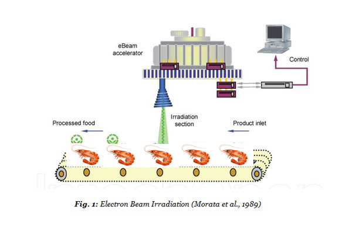

```{r setup, include=FALSE}
knitr::opts_chunk$set(echo = FALSE)
library(readxl) # Proporciona funciones para leer datos en formatos de archivos de Excel
library(dplyr) # Ofrece una serie de funciones para manipulación y transformación de datos
library(ggplot2) # Permite crear visualizaciones gráficas de alta calidad 
library(ggpmisc) # Proporciona complementos y funciones adicionales para gráficos de ggplot2, como etiquetas de ecuaciones y líneas de ajuste
library(pROC) # Permite calcular y visualizar curvas ROC (Receiver Operating Characteristic) y otras métricas relacionadas con la evaluación de modelos de clasificación.
library(randomForest) # Implementa el algoritmo Random Forest para construir y analizar modelos de ensamble basados en árboles de decisión
library(caret) # Proporciona herramientas para el preprocesamiento de datos, selección de características y ajuste de modelos de aprendizaje automático.
library(rpart.plot) #Permite visualizar árboles de decisión generados con el paquete rpart
library(rpart) # Implementa el algoritmo CART (Classification and Regression Trees) para construir árboles de decisión.
library(pander) # Facilita la generación de tablas
library(e1071) # Implementa el algoritmo de maquinas de soporte vectorial tanto para regresión como para clasificación
library(gridExtra) # Permite crear fácilmente gráficos de alto nivel y organizarlos en diseños de cuadrícula.
library(kernlab) # Proporciona implementaciones para SVM, regresión ridge, regresión logística, clustering y más.
library(plotly) #  Gennera gráficos interactivos.
library(drda) # Fit logistic functions to observed dose-response continuous
```

# **PLAN DE LA CLASE**

**1.- Introducción**

- Tipos de modelos predictivos.

- Estudio de caso: SVM en camarones irradiados.

- Support vector machine (SVM): ¿Qué son y para que sirven?.

- Estudios de caso: Predicción de peso y predicción de abundancia de microalgas tóxicas.

- Métricas para medir el desempeño de un modelo de regresión.

- Práctica con ejemplo de maduración temprana.

**2.- Práctica con R y Rstudio cloud.** 

- Realizar modelamiento predictivo con Máquinas de Soporte Vectorial. 

- Realizar gráficas avanzadas con plotly. 


# **MACHINE LEARNING Y MODELOS PREDICTIVOS**

Existen diferentes modelos predictivos, los cuales se clasifican bajo el marco del aprendizaje automático, machine learning en inglés, como algoritmos o metodos supervisados y no supervisados.


```{r, echo=FALSE, out.width = '95%',fig.align='center'}
knitr::include_graphics("Machine_learning_fig.png")
```


# **ESTUDIO DE CASO: CAMARON IRRADIADO**

- ¿Cómo distinguir camarón irradiado v/s no irradiado?

```{r, out.width='80%',fig.align='center'}

```

[Fuente: Xiong et al. 2016](https://doi.org/10.1016/j.jfoodeng.2015.12.008)

# **ESTUDIO DE CASO: ANÁLISIS IMÁGENES MULTIESPECTRAL**

- Análisis de 19 variables en diferentes longitudes de onda.

```{r, out.width='70%',fig.align='center'}
knitr::include_graphics("Multiespectral.png")
```

# **MODELOS PREDICTIVOS**

```{r, out.width='100%',fig.align='center'}
knitr::include_graphics("Mod_paper.jpg")
```


[Fuente: Aljanad et al. 2021](https://doi.org/10.3390/en14041213)

[Fuente: Dameshghi & Refan, 2021](https://doi.org/10.1007/s12667-019-00357-9)


# **¿CÓMO MEDIR EL DESEMPEÑO DEL MODELO DE CLASIFICACIÓN?**

**Para problemas con dos clases:**

```{r, out.width='90%',fig.align='center'}

```


# **¿CÓMO MEDIR EL DESEMPEÑO DEL MODELO DE CLASIFICACIÓN?**

**Para problemas multi-clase:** 

```{r, out.width='90%',fig.align='center'}

```


# **ALGORITMO SUPERVISADO MÁQUINAS DE SOPORTE VECTORIAL (SVM): CLASIFICACIÓN**

SVM fue creado por Vladimir Vapnik y su equipo en los años 90 en los laboratorios de AT&T Bell en los Estados Unidos.

- SVM es un algoritmo de aprendizaje supervisado utilizado para clasificación y regresión.

- SVM encuentra un hiperplano en un espacio de alta dimensión que mejor separa las clases de datos.

- Se enfoca en encontrar los vectores de soporte, que son las observaciones más cercanas a la separación entre clases.

- Es efectivo incluso en espacios de alta dimensión (> Variables que observaciones).


# **MÁQUINAS DE SOPORTE VECTORIAL (SVM)**

- Hay problemas de clasificación y regresión linealmente separables (**_Kernel lineal_**).

- SVM no lineales permiten modelar relaciones complejas y no lineales entre las variables predictoras y la variable respuesta (**_Kernel de base radial_**, **_Kernel polinomial_** y **_Kernel sigmoidal_**).

```{r, echo=FALSE, out.width = '70%',fig.align='center'}
knitr::include_graphics("SVM.png")
```

# **PARTES DE SVM**

```{r, echo=FALSE, out.width = '85%',fig.align='center'}
knitr::include_graphics("SVM_dimensiones.jpg")
```

[Fuente: Bianco et al., 2019](https://pubs.aip.org/asa/jasa/article/146/5/3590/994832/Machine-learning-in-acoustics-Theory-and)

[Página web](https://numerentur.org/svm/)

# **TIPOS DE KERNELS EN SVM**

kernel es una función matemática que mide la similitud entre pares de datos en un espacio de características. El kernel en SVM es una herramienta especial que nos permite convertir datos difíciles de separar en un espacio donde sí pueden ser separados.

| Tipo de Kernel       | Hiperparámetros               | Uso                                  |
|----------------------|-------------------------------|--------------------------------------|
| Lineal               | C (parámetro de costo)        | Clasificación y regresión lineal   |
| Base Radial (RBF)    | C (parámetro de costo)        | Clasificación y regresión no lineal |
|                      | gamma (parámetro del kernel RBF) |                                      |


# **EJERCICIO: MADURACIÓN TEMPRANA CON SVM**

```{r, message=FALSE, out.width = '70%', fig.align='center', error=FALSE, warning=FALSE}

# Generar objeto My_Theme para personalizar el gráfico 
My_Theme <- theme(axis.title.x = element_text(size = 20, face = "bold"),
                  axis.text.x = element_text(size = 20,face = "bold"),
                  axis.title.y = element_text(size = 20, face = "bold"),
                  axis.text.y = element_text(size = 20,face = "bold"))

# Importar la base de datos
datos <- read_excel("Maturation.xlsx")


# Transformar la variable Maturation a factor
datos$Maturation <- as.factor(datos$Maturation)

# Cambiar la clase 1 como la clase positiva
datos$Maturation <- relevel(datos$Maturation, ref = "1")

# Generar base de datos con variables de interes
Datos_def <- datos%>% 
  select("Mass","SGR", "Length","GSI","Maturation")

# División del conjunto de datos en entrenamiento y prueba
set.seed(123)
train_indices_all <- createDataPartition(Datos_def$Maturation, p = 0.7, list = FALSE)
train_data_all <- Datos_def[train_indices_all, ]
test_data_all <- Datos_def[-train_indices_all, ]
pander(head(Datos_def,10))

```


# **PREDICCIÓN EN SVM DE CLASIFICACIÓN**

```{r, echo=FALSE, out.width = '80%',fig.align='center'}
knitr::include_graphics("SVM_Clas.png")
```

# MATRIZ DE CONFUSIÓN 

```{r, message=FALSE, out.width = '70%', fig.align='center'}

# Ajustar el modelo SVM radial con búsqueda de parámetros y validación cruzada
set.seed(123)
tune_grid_svm <- expand.grid(sigma = c(0.1, 1, 10), C = c(0.1, 1, 10))

modelo_train <- train(Maturation ~ Mass + SGR + GSI, data = Datos_def, method = "svmRadial",
                      trControl = trainControl(method = "cv", number = 5),
                      tuneGrid = tune_grid_svm)

# Ajustar el modelo SVM con los mejores parámetros encontrados
set.seed(123)
modelo_svm <- svm(Maturation ~ Mass + SGR + GSI, data = train_data_all, kernel = "radial",
                  gamma = modelo_train$bestTune$sigma, cost = modelo_train$bestTune$C)

# Predecir las etiquetas para los datos de prueba
predicciones_SVM <- predict(modelo_svm, test_data_all,type = "class")

# Agregar las etiquetas predichas al conjunto de datos de prueba
test_data_all$pred_SVM <- predicciones_SVM

# Matriz de confusión - SVM
confusion_SVM <- confusionMatrix(predicciones_SVM, test_data_all$Maturation)

# Obtener la matriz de confusión con las etiquetas modificadas
confusion_SVM_mod  <- confusion_SVM[["table"]]
rownames(confusion_SVM_mod) <- c("Maduro","Inmaduro")
colnames(confusion_SVM_mod) <- c("Maduro","Inmaduro")

pander(confusion_SVM_mod, caption = "Matriz de Confusión SVM",
       split.cells = 20, style = "grid")

# Extraer la metrica accuracy del objeto confusion_SVM
ACC_SVM<- round(confusion_SVM$overall['Accuracy'],2)

# Extraer la metrica sensibilidad del objeto confusion_SVM
SEN_SVM <- round(confusion_SVM$byClass['Sensitivity'],2)

# Extraer la metrica especificidad del objeto confusion_SVM
SPE_SVM <- round(confusion_SVM$byClass['Specificity'],2)

```


$ACC = \frac{(14+11)}{(14+0+1+11)}= 0.96$

$SEN = \frac{(14)}{(14+0)}= 1$

$SPE = \frac{(11)}{(11+1)}= 0.92$


# **AREA BAJO LA CURVA ROC (AUC) PARA SVM**

```{r, message=FALSE, out.width = '70%', fig.align='center', echo=FALSE, warning=FALSE, error=FALSE, message=FALSE}

# Crear objeto de curva ROC
roc_obj_SVM <- roc(as.numeric(test_data_all$Maturation), as.numeric(test_data_all$pred_SVM))

# Obtener datos de sensibilidad y especificidad
roc_data_SVM <- coords(roc_obj_SVM, "all")

# Calcular el área bajo la curva ROC
auc_SVM <- auc(roc_obj_SVM)

# Crear gráfico de la curva ROC
ggplot(roc_data_SVM, aes(x = 1 - specificity, y = sensitivity)) +
  geom_path(color = "darkblue", size = 1.5) +
  geom_abline(intercept = 0, slope = 1, linetype = "dashed", color = "red") +
  labs(x = "Tasa de Falsos Positivos (1 - Especificidad)",
       y = "Tasa de Verdaderos Positivos (Sensibilidad)",
       title = "Curva ROC",
       subtitle = paste("AUC =", round(auc_SVM, 2))) +
  theme_minimal() +
  theme(plot.title = element_text(size = 16, face = "bold"),
        plot.subtitle = element_text(size = 14),
        axis.title = element_text(size = 12),
        axis.text = element_text(size = 10),
        legend.position = "none")+My_Theme

```


# **ESTUDIO DE CASO 2: RESISTENCIA A PATÓGENOS**

- Variable predicha: Resistencia a koi herpes virus en carpa (Resistente = 0; Susceptible =1).
- Variables predictoras: 15.615 genotipos SNP.

```{r, echo=FALSE, out.width = '80%',fig.align='center'}
knitr::include_graphics("Genotipo.png")
```
[Fuente: Palaiokostas 2021](https://doi.org/10.1016/j.aqrep.2021.100660)
[Imagen referencial modificada: Seal. et al. 2020](https://elifesciences.org/articles/68874)

# **MÉTODOS DE PREDICCIÓN Y PERFORMANCE**

1.- MÉTODOS

- GBLUP: Predicción lineal insesgada genómica (Una para cada genotipo, Línea base).

- ML: SVM, RF, Decision Trees (DT), otros.

2.- MEDIDAS DE PERFORMANCE

- Curva ROC: Relación entre la tasa de verdaderos positivos (Sensibilidad) y la tasa de falsos positivos (1-Especificidad).

- AUC (Area Under the Curve): Valor numérico que se obtiene a partir de la curva ROC y es un indicador de la capacidad de discriminación del modelo de clasificación.

- Un AUC de 1.0 significa que el modelo tiene una capacidad perfecta para distinguir entre las dos clases, mientras que un AUC de 0.5 indica que el modelo no es mejor que una clasificación aleatoria.

# **COMPARACIÓN MODELOS: AUC**

```{r, echo=FALSE, out.width = '80%',fig.align='center'}

```

# **COMPARACION MODELOS: TIEMPO.**

```{r, echo=FALSE, out.width = '80%',fig.align='center'}
knitr::include_graphics("Time.png")
```

# **EJERCICIO CON R: RESISTENCIA A PATÓGENOS**

n: 1259 observaciones y 9 genotipos SNP.

```{r, message=FALSE, out.width = '70%', fig.align='center', error=FALSE, warning=FALSE}
# Create a data frame Dose - Response.
data <- read_excel("Datos_Geno.xlsx")

# Reemplazar los valores faltantes (NA) por la moda de cada columna
data <- data %>%
  mutate_if(is.numeric, function(x) ifelse(is.na(x), median(x, na.rm = TRUE), x)) %>%
  mutate_if(is.factor, function(x) ifelse(is.na(x), names(sort(table(x)))[length(names(sort(table(x))))], x))

# Transformar la variable survival a factor
data$survival <- as.factor(data$survival)

# Cambiar la clase 1 como la clase positiva
data$survival <- relevel(data$survival, ref = "1")

set.seed(123) # Establecer una semilla para reproducibilidad
train_indices <- sample(1:nrow(data), 0.7 * nrow(data))
train_data <- data[train_indices, ]
test_data <- data[-train_indices, ]

# Submuestreo de la clase mayoritaria
class_mayoritaria <- filter(train_data, survival == "0")
class_minoritaria <- filter(train_data, survival == "1")

# Obtener el número de muestras de la clase mayoritaria y menor
n_mayoritaria <- nrow(class_mayoritaria)
n_minoritaria <- nrow(class_minoritaria)

# Realizar el submuestreo duplicando aleatoriamente muestras de la clase minoritaria
class_minoritaria_upsampled <- class_minoritaria[sample(1:n_minoritaria, n_mayoritaria, replace = TRUE), ]

# Combinar los datos submuestreados de ambas clases
train_data_balanced <- rbind(class_mayoritaria, class_minoritaria_upsampled)

# Ajustar el modelo SVM radial con búsqueda de parámetros y validación cruzada
set.seed(123)
tune_grid_svm <- expand.grid(sigma = c(0.1, 1, 10), C = c(0.1, 1, 10))

modelo_train <- train(survival ~ SNP1+SNP2+SNP3+SNP4+SNP5+SNP6+SNP7+SNP8+SNP9, data = data, method = "svmRadial",
                      trControl = trainControl(method = "cv", number = 5),
                      tuneGrid = tune_grid_svm)

# Ajustar el modelo SVM con los mejores parámetros encontrados en los datos balanceados
modelo_svm_sur <- svm(survival ~ SNP1 + SNP2 + SNP3 + SNP4 + SNP5 + SNP6 + SNP7 + SNP8 + SNP9, 
                      data = train_data_balanced, kernel = "radial",
                     gamma = modelo_train$bestTune$sigma, cost = modelo_train$bestTune$C)

# Predecir las etiquetas para los datos de prueba
predicciones_SVM_sur <- predict(modelo_svm_sur, test_data, type = "class")

# Agregar las etiquetas predichas al conjunto de datos de prueba
test_data$pred_SVM_sur <- predicciones_SVM_sur

# Matriz de confusión - SVM
confusion_SVM_sur <- confusionMatrix(predicciones_SVM_sur, test_data$survival)

# Obtener la matriz de confusión con las etiquetas modificadas
confusion_SVM_sur_mod  <- confusion_SVM_sur[["table"]]
rownames(confusion_SVM_sur_mod) <- c("Muerto","Vivo")
colnames(confusion_SVM_sur_mod) <- c("Muerto","Vivo")

pander(confusion_SVM_sur_mod, caption = "Matriz de Confusión SVM Sobrevivencia",
       split.cells = 20, style = "grid")

# Extraer la métrica accuracy del objeto confusion_SVM
ACC_SVM_Sur <- round(confusion_SVM_sur$overall['Accuracy'], 2)

# Extraer la métrica sensibilidad del objeto confusion_SVM
SEN_SVM_Sur <- round(confusion_SVM_sur$byClass['Sensitivity'], 2)

# Extraer la métrica especificidad del objeto confusion_SVM
SPE_SVM_Sur <- round(confusion_SVM_sur$byClass['Specificity'], 2)

```

$ACC = \frac{(84+117)}{(84+130+47+117)}= 0.53$

$SEN = \frac{(84)}{(84+47)}= 0.64$

$SPE = \frac{(117)}{(117+130)}= 0.47$


# **AREA BAJO LA CURVA ROC (AUC) PARA SVM**

```{r, message=FALSE, out.width = '70%', fig.align='center', echo=FALSE, warning=FALSE, error=FALSE, message=FALSE}

# Crear objeto de curva ROC
roc_obj_SVM_sur <- roc(as.numeric(test_data$survival), as.numeric(test_data$pred_SVM_sur))

# Obtener datos de sensibilidad y especificidad
roc_data_SVM_sur <- coords(roc_obj_SVM_sur, "all")

# Calcular el área bajo la curva ROC
auc_SVM_sur <- auc(roc_obj_SVM_sur)

# Crear gráfico de la curva ROC
ggplot(roc_data_SVM_sur, aes(x = 1 - specificity, y = sensitivity)) +
  geom_path(color = "darkblue", size = 1.5) +
  geom_abline(intercept = 0, slope = 1, linetype = "dashed", color = "red") +
  labs(x = "Tasa de Falsos Positivos (1 - Especificidad)",
       y = "Tasa de Verdaderos Positivos (Sensibilidad)",
       title = "Curva ROC",
       subtitle = paste("AUC =", round(auc_SVM_sur, 2))) +
  theme_minimal() +
  theme(plot.title = element_text(size = 16, face = "bold"),
        plot.subtitle = element_text(size = 14),
        axis.title = element_text(size = 12),
        axis.text = element_text(size = 10),
        legend.position = "none")+My_Theme

```


# **PRÁCTICA ANÁLISIS DE DATOS**

- El trabajo práctico se realiza en Rstudio.cloud. 


# **RESUMEN DE LA CLASE**

- Obtener los mejores parámetros para los modelos de SVM.

- Realizar predicciones con SVM.

- Métricas de evaluación (AUC, Accuracy, MSE).
